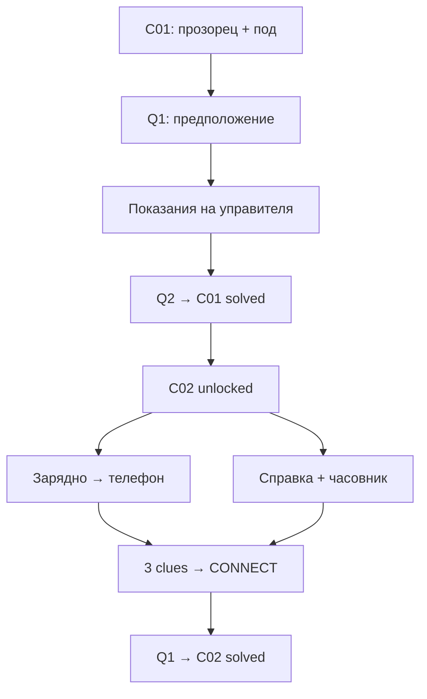
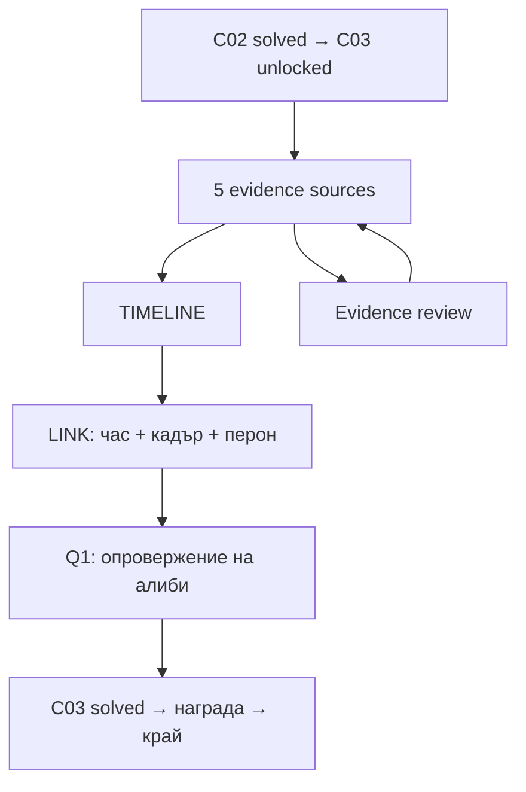

# CASE ZERO — Vertical Slice: Game Design & Implementation Specification

Версия 1.0 • 5 октомври 2026 • Език на спецификацията и тестовия build: български

Статус: проектна спецификация за реализация и последващ playtest. Не е готова игра, финален art pack или доказателство за постигнати usability/retention резултати.

Източници: прочетени изцяло „Pasted text(4).txt“ — задачата за дизайнера, и „Pasted text(2).txt“ — GAME DESIGN BRIEF на Marketing/Product Director. При различен обхват приоритет има текущата задача: три завършени случая, без дизайн на цялата бъдеща игра. Всички сюжетни лица, записи, учреждения, устройства, дати и разписания по-долу са измислени за играта. Не представляват реални криминалистични доказателства или описание на действителен Android API.

## Как да се използва

Частите 1–4 са общият договор. Части 5–7 го инстанцират за всеки случай. Спецификация на обект = индивидуалната му таблица + изрично посочения общ interaction profile. Не се добавят интерактивни предмети от художника или програмиста без промяна на този договор. Идентификаторите са case-sensitive. Всички правоъгълници са `[x,y,w,h]`; позицията е горен ляв ъгъл, normalized position е **центърът**, не горният ляв ъгъл.

# PART 1 — Executive Game Design Summary

Играчът е неназован разследващ. Всяка сцена поставя проверим въпрос, предлага видими предмети и завършва с обясним извод. Не се изискват знания за телефони, железници или криминалистика извън показаното в играта.

| Случай | Игрово обучение | Целево активно време | Завършек |
|---|---|---|---|
| C01 — The Open Window / Отвореният прозорец | Tap → наблюдение → предположение → потвърждение | 45–75 s | Управителят признава защо е отворил прозореца |
| C02 — The Last Call / Последното обаждане | Три свързани източника → опровергано конкретно твърдение | 75–120 s | Заявеното обаждане не се е състояло |
| C03 — The Wrong Train / Грешният влак | Хронология → свързване на източници → проверка на алиби | 120–180 s | Заподозреният е на перона в заявения интервал |

Времето не е лимит и не влияе на награди. За C01 30–60 s от brief-а остава stretch target; 45–75 s е DESIGNER DECISION заради необходимото честно потвърждение. Ако playtest е по-бавен, първо се съкращават текстовете, не доказателствата.

## Регистър на решенията

Всички детайли, които не са дадени във входните документи, са **DESIGNER DECISION**, конкретизирани чрез следните категории. Това обозначение важи за всички таблици и стойности по-долу.

| ID | DESIGNER DECISION | Причина |
|---|---|---|
| DD01 | C01: репликата става „Прилошало му е до отворения прозорец. Беше отворен цяла вечер.“ | Тяло вътре не подкрепя падане навън; запазваме прозореца и сухия под като централен puzzle |
| DD02 | C01: сухият под позволява „вероятно отворен наскоро“, не доказва сам момента спрямо инцидента | Посоката на дъжда, почистване и други обяснения иначе оставят логическа дупка |
| DD03 | C01: кратко последващо признание на управителя потвърждава кой, кога и защо | Пълен micro-story без произволно обвинение в убийство |
| DD04 | C02: проверяваме точно обикновено клетъчно обаждане от номер A към B, не всеки възможен разговор | Изключва VoIP/друг телефон като скрити условия |
| DD05 | Измислени, проверени разпечатки от разследването са видими предмети в сцената | Дава надежден и разбираем източник без хакване/реален forensic workflow |
| DD06 | C03: един местен ден D, една часова зона, точност на камерите ±1 s; алиби за цялата минута 20:15 | Елиминира двусмислено време, часови зони и разписание срещу реално движение |
| DD07 | Само tap; подреждането е tap карта → tap слот | Управление с един пръст и по-малка production сложност |
| DD08 | Offline slice, без login, ads, IAP, energy, store, реален daily backend | Тества основния loop, без продуктови системи извън обхвата |
| DD09 | 100 XP на първо решение на всеки случай; replay не дава XP | Прост progression без икономика и farming |
| DD10 | 1080×1920 logical canvas, отделни safe-area HUD и scene transforms | Позволява една спецификация върху различни екрани |
| DD11 | Всички числа за timing, палитра, геометрия и performance са проектни цели | Не са измерени резултати или универсални ограничения |
| DD12 | Case Board е и минимален Detective Office; общият мотив е печат „АРХИВ 0“ | Meta-story tease без зависимост на решенията от бъдещо съдържание |

Промените DD01–DD06 са съществени за логиката и трябва да останат в content review. Не се връща първоначалното противоречиво твърдение за падане, без да се преработи цялата сцена.

# PART 2 — Core Gameplay Rules

## Основен loop и свобода

1. Кратка intro карта върху сцената; tap „Разследвай“.
2. Свободен избор на интерактивен предмет. Първият pulse не блокира други предмети.
3. Информацията се вижда в inspection panel, улика се записва веднъж.
4. „Улики“ отваря таблото. Контекстен бутон в него отваря deduction при достатъчни prerequisites.
5. Грешен извод запазва находките и позволява нов опит.
6. Успех → обяснение → награда → следващ случай или Case Board.

Няма скрити timers, случайни отговори, ограничени животи или наказание за hint. Няма пикселно търсене. Не се изисква събиране на незадължителни наблюдения. Няма отделен inventory с употреба на предмети: зарядното е единствено локално действие, без drag.

## Договор за input

Tap се отчита при pointer-up, ако движението е ≤12dp и продължителността ≤500ms върху същия enabled hitbox. По-дълго задържане или по-голямо движение не активира предмет и не е грешка. Един активен pointer; допълнителните се игнорират. Pointer cancel чисти pressed state. Double tap не създава две транзакции: докато modal се отваря, scene input е заключен. Няма pinch/hold/swipe gameplay. Вертикален scroll е позволен единствено в дълги текстови панели и достъпни UI списъци.

При overlap: modal controls > modal backdrop > HUD > scene objects. В рамките на слой: по-висок priority, после по-висок z-index, после лексикографски по-малък Object ID. Декорациите никога не прихващат input. Всички playable scene hitboxes по-долу са неприпокриващи се на baseline.

## P_INSPECT — общ профил за разглеждане

Нормално състояние на всеки inspectable предмет: `UNSEEN` или `SEEN`. Това е знание на играча; физическото състояние е отделна фиксирана стойност. Не се смесват OPEN и INSPECTED в една enum.

| Current → input | Condition | Transition и state change | Feedback / next |
|---|---|---|---|
| UNSEEN → TAP | SCENE active; gate=true | transient PRESSING, selected_object=id; през t=0 atomic transaction: state=SEEN, add evidence idempotently, recompute gates, persist | pressed 0–80ms; panel opens 0–180ms; от t=180ms се виждат detail и текст |
| SEEN → TAP | Същите | state остава SEEN; отваря същия detail; няма втори evidence event | SFX_UI_TAP; label „Прегледано“ |
| Any → TAP | gate=false | не променя object/evidence | кратък object-specific locked feedback, 1500ms; няма fail penalty |
| INSPECT modal → CLOSE / Android Back / tap backdrop | няма confirmation child | selected_object=null; modal closed | fade 120ms → SCENE |

Улика се записва атомарно при приет tap; анимацията е само визуална и не управлява progress. Новата evidence карта се показва като toast от t=180 до 880ms, scale 0.96→1.0 за 120ms, текст „Улика открита“. Inspection остава отворен докато играчът го затвори. Toast не блокира tap и не е отделен route. При затваряне преди t=880 toast се отменя, улика остава записана. При повторен tap само UI sound. Без улика има само текст на наблюдението, без clue sound/haptic.

Камерата при всички P_INSPECT: **full scene 1.0×, без pan/zoom, duration 0ms**. Detail картинка се показва в UI, не чрез увеличение на камерата. Target=Asset ID на предмета, aspect-fit в detail rect. Това е разрешеният object close-up и избягва offscreen zoom върху тесни екрани. Няма pinch. Всички scene objects имат Zoomable=NO.

## Други профили

`P_CHARGER`: същото отваряне, плюс локален CTA „Свържи“. Ако phone не е възстановен, TAP CTA атомарно задава charger=CONNECTED и phone_power=RESTORED, звук SFX_CONNECT; сменя рисунка за 250ms; няма реално чакане за зареждане. Label: „След кратко зареждане…“. Close остава разрешен. Ако вече е connected, CTA disabled „Свързан“; повторният tap не прави нищо. Няма автоматично добавена улика от телефона — трябва да бъде разгледан.

`P_PHONE`: когато phone_power=EMPTY, tap записва EV_C02_BATTERY и показва празна батерия. При RESTORED tap записва EV_C02_IDENTITY; modal показва номер B, собственик и местен call log. Първият tap след зареждане добавя и EV_C02_BATTERY, ако липсва, с общ toast „2 наблюдения добавени“ и един haptic. Това е архивирано първоначално състояние, надпис „При намиране: 0%“. Зареждането първо е валидна последователност.

`P_MANAGER`: gate=Q1 accepted; преди това предметът е видим с икона катинар, tap „Първо сравни прозореца и пода.“; след това е P_INSPECT с признание, evidence и фиксирано физическо състояние READY.

## Failure contract

| Действие | Response | Прогрес |
|---|---|---|
| Tap декорация/празна сцена | Няма звук, ripple, event за clue или penalty | Без промяна |
| Грешен answer / evidence set / timeline | Error inline 1500ms + SFX_WRONG_DEDUCTION; без shake на целия екран | Attempts +1; изборът остава editable |
| Недостатъчни улики | Deduction CTA disabled с видим текст „Нужни са още улики“; handler guard връща PRECONDITION_MISSING | Без attempt |
| Submit без достатъчно selections | Disabled; guard INVALID_SELECTION | Без attempt |
| Неправилен gesture | Cancel pressed; не мести предмет | Без промяна |
| Повторна улика | Същият detail; „Прегледано“ | Няма дубликати/XP |
| Save failure | Временно състояние WRITE_PENDING, retry / „Върни последния запис“ | Не се показва завършен success преди потвърден write |

Няма hard fail. След грешка не се забранява верният отговор и не се отключва автоматично решение. Hint е винаги свободен.

# PART 3 — Visual & UX Direction

## Арт договор

Stylized realistic premium casual illustration: реалистични пропорции, опростени материални детайли, чисти силуети, без фотографски текстури или gore. Тялото в C01 е покрито със светло одеяло; няма лице на жертва или видими наранявания. Източникът на загадката е средата, не шокът.

Палитра: фон `#202E38`, панели `#F3EBDD`, текст `#162733`, subdued `#52616B`, accent `#B27A35`, selected `#285D70`, success `#23664F`, error `#963F3F`. Художествените цветове не заместват контур, икона и текст. Проверка на контраст върху реалния build; цел 4.5:1 за body text. Lighting е нарисуван, няма runtime lights.

Typography: bundled Noto Sans с кирилица или еквивалентен лицензиран sans; заглавие 26sp, body 18sp, secondary 16sp, evidence timestamp 20sp semibold. Табличните часове са live text, не текст в PNG. Отговорите са цели изречения до 2–3 реда. Поддържат се font scale 1.0–2.0; не се намалява шрифт за побиране. При голям font използвай scroll и footer извън scroll.

## Layout и responsive contract

Canvas 1080×1920, origin (0,0) горе вляво, +X надясно, +Y надолу. Canonical safe-frame `[0,72,1080,1776]`; header `[48,96,984,144]`; scene art viewport `[0,264,1080,1332]`; footer `[48,1632,984,144]`. Допълнителната долна зона до 1848 е свободна за системна навигация. Сцената не съдържа важен предмет извън scene viewport.

На устройство: U = реалният safe rect след Android insets. Header и footer са native UI, anchored към U top/bottom с 16dp външен margin, минимум 48dp touch. Между тях се вписва scene viewport с uniform scale `s=min(availableWidth/1080, availableHeight/1332)` и center alignment. Scene object screenX=sceneLeft+x*s; screenY=sceneTop+(y-264)*s. Input използва inverse transform. Никога не се разтегля X различно от Y и не се crop-ва улика. Свободните ленти имат цвета на фона.

Normalized center `(cx/1080,cy/1920)` е export метаданна за canonical canvas. **Не** умножавай директно по целия физически екран на tall devices. Scene transform е авторитетен. UI се reflow-ва отделно.

Физически min hitbox = 48dp, независимо от PNG пиксели. При display scaling изчисли hitbox size в dp, увеличи симетрично до 48dp и ограничи в scene viewport. Ако expansion предизвика overlap, приложи priority. Ако две expanded hitboxes се застъпват с >25% от по-малката площ, използвай inspection list fallback: натискането в overlap отваря списък с двата object labels, два 48dp реда, без автоматичен избор. Този transient UI използва G_PICKER и същите gates. Проверява се минимум 360×640dp, 360×800dp и 412×915dp; за по-малки usable области се използва същият list fallback. Tablet: scene display max width 600dp, центрирана; HUD max width 600dp. Portrait locked; rotation не губи state.

## Wireframe contract

| Област | Rect на baseline | Съдържание |
|---|---|---|
| Header | 48,96,984,144 | Case title + objective, без магазин |
| Сцена | 0,264,1080,1332 | Само обектите в case register |
| Hint | 48,1632,456,144 | Икона ? и „Подсказка“ |
| Evidence | 576,1632,456,144 | Икона папка и „Улики x/y“ |
| Modal surface | 48,312,984,1248 | Inspection, hints, evidence или deduction |
| Modal close | 864,336,144,144 | X, accessible „Затвори“ |
| Detail image | 96,504,888,456 | Aspect-fit, без cropped timestamps |
| Detail body | 96,984,888,264 | Scroll text при нужда |
| Modal primary CTA | 96,1344,888,144 | Специфично действие |

Цифрите са текстов wireframe за developer/UX. Финални илюстрации, high-fidelity екрани и Figma prototype не са създадени с тази спецификация; те са отделни production deliverables, със зададени размери и acceptance criteria тук.

# PART 4 — Global UI System

## Routes и навигация

`G_BOOT` → първа сесия C01_INTRO; следващи сесии G_BOARD. Splash е статичен CASE ZERO, без minimum wait; boot приключва веднага след load на save и manifest. G_BOARD има три case cards и XP. Няма login. Tap unlocked card: незапочнат → INTRO, започнат → SCENE, решен → confirmation REPLAY. C01 е винаги unlocked; C02 iff completed[C01]; C03 iff completed[C02].

Android Back: detail/hint/evidence/deduction/picker → предишен route; SCENE → PAUSE; INTRO → BOARD; SOLVED/REWARD → BOARD (наградата вече е записана); BOARD → системно back поведение. Back не подава deduction и не губи findings.

| Screen ID | Entry | Visible / interactive | Exit и next |
|---|---|---|---|
| G_BOOT | launch | Logo, loading/error retry | Load OK → C01_INTRO или G_BOARD |
| G_BOARD | boot/exit/reward | 3 карти, XP, Settings; unlocked cards clickable | Card → case; settings → G_SETTINGS |
| G_SETTINGS | settings tap | Sound, haptic, reduced motion toggles; Close | Persist option веднага; Close/Back → BOARD |
| G_PICKER | тесен overlap | 2+ object label buttons + Close | Избор → конкретен INSPECT; Close → SCENE |
| G_WRITE_ERROR | write failure | „Не успяхме да запазим“; Retry; Revert | Retry transaction → предишен target; Revert → последно committed SCENE/BOARD |
| G_END | C03 reward Continue | „Три случая. Една нова следа: АРХИВ 0.“; „Към таблото“ | Button/Back → BOARD |

Неактивни продуктови placeholders: Office = визуален desk в BOARD; Daily/Store/No Ads не са достъпни routes в slice, нямат input или purchase код. Това е DD08 за ограничаване на обхвата спрямо общия marketing wishlist; не се показват мъртви бутони на тестовия играч.

## Общи UI обекти и координати

Тези параметризирани IDs се инстанцират с case prefix. Нормализираните координати се изчисляват по общата формула; геометрията е baseline, при font scale се reflow-ва.


| Object ID | Rect = hitbox | Normalized center | Visible when | Tap |
| --- | --- | --- | --- | --- |
| UI_HINT | [48, 1632, 456, 144] | 0.255556, 0.887500 | SCENE | Open HINT; SFX_UI_TAP |
| UI_EVIDENCE | [576, 1632, 456, 144] | 0.744444, 0.887500 | SCENE | Open EVIDENCE; SFX_UI_TAP |
| UI_CLOSE | [864, 336, 144, 144] | 0.866667, 0.212500 | modal | Close top modal; SFX_UI_TAP |
| UI_PRIMARY | [96, 1344, 888, 144] | 0.500000, 0.737500 | INTRO/INSPECT/DEDUCTION/SOLVED/REWARD/HINT | Screen-specific guarded action |
| UI_ANSWER_0 | [96, 600, 888, 168] | 0.500000, 0.356250 | DEDUCTION | Select answer 0 |
| UI_ANSWER_1 | [96, 792, 888, 168] | 0.500000, 0.456250 | DEDUCTION | Select answer 1 |
| UI_ANSWER_2 | [96, 984, 888, 168] | 0.500000, 0.556250 | DEDUCTION | Select answer 2 |
| UI_BOARD_C01 | [96, 432, 888, 240] | 0.500000, 0.287500 | BOARD | Enter C01 |
| UI_BOARD_C02 | [96, 720, 888, 240] | 0.500000, 0.437500 | BOARD | Enter C02 iff unlocked |
| UI_BOARD_C03 | [96, 1008, 888, 240] | 0.500000, 0.587500 | BOARD | Enter C03 iff unlocked |
| UI_SETTINGS | [864, 96, 144, 144] | 0.866667, 0.087500 | BOARD | Open SETTINGS |
| UI_PAUSE_BOARD | [96, 600, 888, 168] | 0.500000, 0.356250 | PAUSE | Save → BOARD |
| UI_PAUSE_RESTART | [96, 792, 888, 168] | 0.500000, 0.456250 | PAUSE | Open CONFIRM_RESET |
| UI_PAUSE_RESUME | [96, 984, 888, 168] | 0.500000, 0.556250 | PAUSE | Return SCENE |
| UI_CONFIRM_YES | [96, 1152, 408, 168] | 0.277778, 0.643750 | CONFIRM_RESET | Reset current run; INTRO |
| UI_CONFIRM_NO | [576, 1152, 408, 168] | 0.722222, 0.643750 | CONFIRM_RESET | Return PAUSE/BOARD |


Общи UI state machine: NORMAL → pointer-down → PRESSED → pointer-up valid → действие + NORMAL/SELECTED. Pointer cancel → NORMAL. DISABLED input → no-op. Answer/card tap toggles SELECTED; single-choice answer маха предишния избор. SUCCESS/ERROR са резултатни визуални states, не самостоятелни input handlers. UI_CLOSE винаги enabled освен докато се извършва atomic write. Няма draggable/swipeable/zoomable UI.

Evidence panel: 5 card slots с rect `[96, 504+i*156, 888, 144]`, i=0..4, в scroll viewport `[96,504,888,780]`; редът е редът на evidence registry, не discovery. Locked cards не показват съдържание, само „Неоткрита улика“. Discovered card tap → DETAIL_CARD със същия текст и икона; close връща EVIDENCE. Required counter брои само required findings; optional има отделен етикет „Наблюдение“. Evidence CTA „Направи извод“ показва текущия stage. В C01 след Q1 CTA показва „Провери показанията“ и затваря към SCENE докато няма признание.

C02 CONNECT и C03 LINK: същите evidence rows са selectable; checkbox и номера 1/2/3; максимум 3 selections. Tap четвърта → toast „Избери до 3“, без attempt. Submit е enabled само при точно 3. Ако optional cards увеличат списъка, viewport се scroll-ва; footer fixed.

Hint panel: текст `[96,552,888,480]`; primary „Следваща подсказка“, на трето ниво „Повтори насоката“. Level се повишава при CTA, не с времето. First open задава 1; max=3. Hint фокусира първия липсващ обект от case order, 2 pulses ×600ms; всички събрани → насока към deduction control. Hints са безплатни и не намаляват XP.

Pause: Android Back от SCENE; текст „Пауза“, бутони в UI table. Restart и replay винаги отварят confirmation „Започни случая отначало? Намерените улики в този опит ще бъдат изчистени.“ Yes чисти само run state; campaign completion и XP не се чистят. No връща отварящия screen.

Success sequence: valid final submit → atomic completed=true и reward_granted=true при първо решение, XP +=100 → SOLVED с SFX_CASE_SOLVED, MEDIUM haptic, 300ms accent draw. Текстът и CTA са видими веднага. „Продължи“ → REWARD, XP анимация 0–100 за 500ms (skip при tap), после „Следващ случай“ → next INTRO; C03 → G_END. Replay показва „Случаят е решен отново • +0 XP“. Няма автоматично прехвърляне преди прочитане.


# PART 5 — C01 Full Design

## Story

**The Open Window / Отвореният прозорец**

DESIGNER DECISION: сюжет, факти и реплики по DD01–DD06.

Opening text: „Гост е намерен безжизнен в стая 204. Управителят: „Прилошало му е до отворения прозорец. Беше отворен цяла вечер.““

Objective: **Провери историята за прозореца.**

Това разследване установява промяна на сцената, не причина за смъртта. Управителят е отворил прозореца след намирането на госта, за да проветри, после е премълчал намесата си от страх. Първо играчът оспорва версията, после получава потвърждение. Финалът изрично не обвинява управителя в убийство.

## Scene

Светла хотелска стая. Прозорец горе вдясно, сух дървен под под него, ниска маса вляво, покрито тяло в долната лява част, карта „Допълни показанията“ вдясно долу. Дъждът е видим зад прозореца; никога не рисувай мокри петна върху обозначения сух под.

Primary: прозорец и светлия под под него. Secondary: карта на управителя след Q1. Светлина от горе вдясно, студена външна и мека топла лампа вляво. Фонът е с по-нисък локален контраст; чашата е видима, но не по-контрастна от прозореца. Pulse на WINDOW през първите 5 s, спира при първи accepted scene tap; никога не блокира exploration.


### Схема и координати

Фонът е един flattened scene asset. Отделните по-долу предмети са прозрачни sprites върху него. Художникът оставя празни съответните места във фона; няма дублирано нарисуван интерактивен предмет. Общият HUD от част 4 е над сцената.


| Object ID | Име | x,y,w,h | Center | Normalized center | Hitbox | z-index |
| --- | --- | --- | --- | --- | --- | --- |
| C01_WINDOW | Отворен прозорец | [648, 336, 336, 480] | (816, 576) | (0.755556, 0.300000) | [624, 312, 384, 528] | 10 |
| C01_FLOOR | Под под прозореца | [624, 936, 360, 216] | (804, 1044) | (0.744444, 0.543750) | [600, 912, 408, 264] | 11 |
| C01_SHOES | Обувки | [408, 1224, 168, 168] | (492, 1308) | (0.455556, 0.681250) | [384, 1200, 216, 216] | 12 |
| C01_CUP | Чаша с тъмен ръб | [144, 768, 168, 192] | (228, 864) | (0.211111, 0.450000) | [120, 744, 216, 240] | 13 |
| C01_CLOCK | Стенен часовник | [144, 360, 192, 168] | (240, 444) | (0.222222, 0.231250) | [120, 336, 240, 216] | 14 |
| C01_MANAGER | Карта: допълни показанията | [696, 1272, 264, 192] | (828, 1368) | (0.766667, 0.712500) | [672, 1248, 312, 240] | 15 |
| C01_BODY | Покрито тяло | [96, 1056, 264, 456] | (228, 1284) | (0.211111, 0.668750) | NONE | 16 |


## Objects — clickable / non-clickable register


| Object ID | Object | Visible | Clickable | Interaction | Purpose |
| --- | --- | --- | --- | --- | --- |
| C01_WINDOW | Отворен прозорец | YES | YES | TAP | Required mechanic/evidence |
| C01_FLOOR | Под под прозореца | YES | YES | TAP | Required mechanic/evidence |
| C01_SHOES | Обувки | YES | YES | TAP | Optional observation |
| C01_CUP | Чаша с тъмен ръб | YES | YES | TAP | Optional observation |
| C01_CLOCK | Стенен часовник | YES | YES | TAP | Optional observation |
| C01_MANAGER | Карта: допълни показанията | YES | YES | TAP | Required mechanic/evidence |
| C01_BODY | Покрито тяло | YES | NO | NONE | Контекст без input |
| C01_BACKGROUND | Flattened фон | YES | NO | NONE | Стени, маса, лампа, стол; само декор |


Всяка разпознаваема лампа, маса, стол или стенна украса е част от BACKGROUND и е non-clickable. Няма книги, скрити бележки, чекмеджета, ключалки или други gameplay-looking props извън регистъра. Background rect `[0,264,1080,1332]`, center `(540,930)`, normalized `(0.5,0.484375)`, layer Scene_Background, z=0, hitbox NONE, state STATIC, visible YES, input NONE, evidence NONE, asset `A_C01_BG`, 1080×1332px static RGB, reusable NO. Не изисква state machine, защото не приема input.


## Interactions — object-by-object technical specification

DESIGNER DECISION: всички геометрии и interaction mappings. Всяка таблица е отделен обект; общите профили са нормативна част от нея. `object.state` означава точно `objects[Object ID].inspection`.


### C01_WINDOW

| Property | Value |
| --- | --- |
| Case ID | C01 |
| Object ID | C01_WINDOW |
| Object name | Отворен прозорец |
| Asset ID | A_C01_WINDOW |
| Position X | 648 |
| Position Y | 336 |
| Width | 336 |
| Height | 480 |
| Center point | 816, 576 |
| Normalized X | 0.755556 |
| Normalized Y | 0.300000 |
| Hitbox | [624, 312, 384, 528] |
| Render layer | Scene_Interactive |
| Z-index | 10 |
| Input priority | 100 |
| Visible state | YES, from INTRO until scene exit |
| Initial state | UNSEEN |
| Physical state | OPEN |
| Clickable | YES |
| Draggable | NO |
| Swipeable | NO |
| Zoomable | NO — UI detail uses aspect-fit image |
| Interaction prerequisite | screen=SCENE AND no modal AND true |
| Input | TAP |
| Profile | P_INSPECT |
| State transition | UNSEEN → TAP [gate] → SEEN; SEEN → TAP [gate] → SEEN; locked → TAP → unchanged |
| Animation | Pressed 80ms; modal 180ms; clue snap 120ms, toast 700ms |
| Camera | 1.0×; position fixed; transition 0ms; no input zoom |
| Sound | SFX_UI_TAP; new evidence → SFX_CLUE_FOUND; charger CTA → SFX_CONNECT |
| Haptic | LIGHT only on first new evidence |
| Result / exact detail copy | Дъжд от 19:00. Към огледа в 22:12 капките влизат навътре и мокрят вътрешния перваз. Няма козирка. |
| Evidence generated | EV_C01_RAIN |
| GameState change | objects[C01_WINDOW].inspection=SEEN; evidence.add(EV_C01_RAIN) |
| Repeat interaction behaviour | Open same panel; no duplicate evidence, no clue haptic, no reward |
| Hint relationship | H1/H2 |
| Success relevance | Required |


**Exact tap flow:** pointer-up on `C01_WINDOW` → validate `true` and SCENE → emit OBJECT_TAPPED → execute `P_INSPECT` transaction → emit OBJECT_INSPECTED → add the specified new evidence IDs, if any → save → show `C01_INSPECT_WINDOW` with the exact copy above → first finding gets 700ms toast → player CLOSE/Back/backdrop → `C01_SCENE`. Camera stays 1.0× throughout. При false gate: toast, no modal/no evidence. При write failure: G_WRITE_ERROR, без фалшив визуален success.


### C01_FLOOR

| Property | Value |
| --- | --- |
| Case ID | C01 |
| Object ID | C01_FLOOR |
| Object name | Под под прозореца |
| Asset ID | A_C01_FLOOR |
| Position X | 624 |
| Position Y | 936 |
| Width | 360 |
| Height | 216 |
| Center point | 804, 1044 |
| Normalized X | 0.744444 |
| Normalized Y | 0.543750 |
| Hitbox | [600, 912, 408, 264] |
| Render layer | Scene_Interactive |
| Z-index | 11 |
| Input priority | 101 |
| Visible state | YES, from INTRO until scene exit |
| Initial state | UNSEEN |
| Physical state | STATIC |
| Clickable | YES |
| Draggable | NO |
| Swipeable | NO |
| Zoomable | NO — UI detail uses aspect-fit image |
| Interaction prerequisite | screen=SCENE AND no modal AND true |
| Input | TAP |
| Profile | P_INSPECT |
| State transition | UNSEEN → TAP [gate] → SEEN; SEEN → TAP [gate] → SEEN; locked → TAP → unchanged |
| Animation | Pressed 80ms; modal 180ms; clue snap 120ms, toast 700ms |
| Camera | 1.0×; position fixed; transition 0ms; no input zoom |
| Sound | SFX_UI_TAP; new evidence → SFX_CLUE_FOUND; charger CTA → SFX_CONNECT |
| Haptic | LIGHT only on first new evidence |
| Result / exact detail copy | Подът непосредствено под прозореца е сух. Не се виждат следи от избърсване. Това поражда въпрос, но само по себе си не доказва кога е отворен. |
| Evidence generated | EV_C01_DRY_FLOOR |
| GameState change | objects[C01_FLOOR].inspection=SEEN; evidence.add(EV_C01_DRY_FLOOR) |
| Repeat interaction behaviour | Open same panel; no duplicate evidence, no clue haptic, no reward |
| Hint relationship | H1/H3 |
| Success relevance | Required |


**Exact tap flow:** pointer-up on `C01_FLOOR` → validate `true` and SCENE → emit OBJECT_TAPPED → execute `P_INSPECT` transaction → emit OBJECT_INSPECTED → add the specified new evidence IDs, if any → save → show `C01_INSPECT_FLOOR` with the exact copy above → first finding gets 700ms toast → player CLOSE/Back/backdrop → `C01_SCENE`. Camera stays 1.0× throughout. При false gate: toast, no modal/no evidence. При write failure: G_WRITE_ERROR, без фалшив визуален success.


### C01_SHOES

| Property | Value |
| --- | --- |
| Case ID | C01 |
| Object ID | C01_SHOES |
| Object name | Обувки |
| Asset ID | A_C01_SHOES |
| Position X | 408 |
| Position Y | 1224 |
| Width | 168 |
| Height | 168 |
| Center point | 492, 1308 |
| Normalized X | 0.455556 |
| Normalized Y | 0.681250 |
| Hitbox | [384, 1200, 216, 216] |
| Render layer | Scene_Interactive |
| Z-index | 12 |
| Input priority | 102 |
| Visible state | YES, from INTRO until scene exit |
| Initial state | UNSEEN |
| Physical state | STATIC |
| Clickable | YES |
| Draggable | NO |
| Swipeable | NO |
| Zoomable | NO — UI detail uses aspect-fit image |
| Interaction prerequisite | screen=SCENE AND no modal AND true |
| Input | TAP |
| Profile | P_INSPECT |
| State transition | UNSEEN → TAP [gate] → SEEN; SEEN → TAP [gate] → SEEN; locked → TAP → unchanged |
| Animation | Pressed 80ms; modal 180ms; clue snap 120ms, toast 700ms |
| Camera | 1.0×; position fixed; transition 0ms; no input zoom |
| Sound | SFX_UI_TAP; new evidence → SFX_CLUE_FOUND; charger CTA → SFX_CONNECT |
| Haptic | NONE |
| Result / exact detail copy | Суха подметка. Само това не показва кога гостът се е прибрал. |
| Evidence generated | NONE |
| GameState change | objects[C01_SHOES].inspection=SEEN; evidence unchanged |
| Repeat interaction behaviour | Open same panel; no duplicate evidence, no clue haptic, no reward |
| Hint relationship | none |
| Success relevance | Not required |


**Exact tap flow:** pointer-up on `C01_SHOES` → validate `true` and SCENE → emit OBJECT_TAPPED → execute `P_INSPECT` transaction → emit OBJECT_INSPECTED → add the specified new evidence IDs, if any → save → show `C01_INSPECT_SHOES` with the exact copy above → first finding gets 700ms toast → player CLOSE/Back/backdrop → `C01_SCENE`. Camera stays 1.0× throughout. При false gate: toast, no modal/no evidence. При write failure: G_WRITE_ERROR, без фалшив визуален success.


### C01_CUP

| Property | Value |
| --- | --- |
| Case ID | C01 |
| Object ID | C01_CUP |
| Object name | Чаша с тъмен ръб |
| Asset ID | A_C01_CUP |
| Position X | 144 |
| Position Y | 768 |
| Width | 168 |
| Height | 192 |
| Center point | 228, 864 |
| Normalized X | 0.211111 |
| Normalized Y | 0.450000 |
| Hitbox | [120, 744, 216, 240] |
| Render layer | Scene_Interactive |
| Z-index | 13 |
| Input priority | 103 |
| Visible state | YES, from INTRO until scene exit |
| Initial state | UNSEEN |
| Physical state | STATIC |
| Clickable | YES |
| Draggable | NO |
| Swipeable | NO |
| Zoomable | NO — UI detail uses aspect-fit image |
| Interaction prerequisite | screen=SCENE AND no modal AND true |
| Input | TAP |
| Profile | P_INSPECT |
| State transition | UNSEEN → TAP [gate] → SEEN; SEEN → TAP [gate] → SEEN; locked → TAP → unchanged |
| Animation | Pressed 80ms; modal 180ms; clue snap 120ms, toast 700ms |
| Camera | 1.0×; position fixed; transition 0ms; no input zoom |
| Sound | SFX_UI_TAP; new evidence → SFX_CLUE_FOUND; charger CTA → SFX_CONNECT |
| Haptic | NONE |
| Result / exact detail copy | Тъмният ръб е следа от кафе. Няма видими данни за отрова; вкусът и външният вид не могат да я изключат. |
| Evidence generated | NONE |
| GameState change | objects[C01_CUP].inspection=SEEN; evidence unchanged |
| Repeat interaction behaviour | Open same panel; no duplicate evidence, no clue haptic, no reward |
| Hint relationship | none |
| Success relevance | Not required |


**Exact tap flow:** pointer-up on `C01_CUP` → validate `true` and SCENE → emit OBJECT_TAPPED → execute `P_INSPECT` transaction → emit OBJECT_INSPECTED → add the specified new evidence IDs, if any → save → show `C01_INSPECT_CUP` with the exact copy above → first finding gets 700ms toast → player CLOSE/Back/backdrop → `C01_SCENE`. Camera stays 1.0× throughout. При false gate: toast, no modal/no evidence. При write failure: G_WRITE_ERROR, без фалшив визуален success.


### C01_CLOCK

| Property | Value |
| --- | --- |
| Case ID | C01 |
| Object ID | C01_CLOCK |
| Object name | Стенен часовник |
| Asset ID | A_C01_CLOCK |
| Position X | 144 |
| Position Y | 360 |
| Width | 192 |
| Height | 168 |
| Center point | 240, 444 |
| Normalized X | 0.222222 |
| Normalized Y | 0.231250 |
| Hitbox | [120, 336, 240, 216] |
| Render layer | Scene_Interactive |
| Z-index | 14 |
| Input priority | 104 |
| Visible state | YES, from INTRO until scene exit |
| Initial state | UNSEEN |
| Physical state | STATIC |
| Clickable | YES |
| Draggable | NO |
| Swipeable | NO |
| Zoomable | NO — UI detail uses aspect-fit image |
| Interaction prerequisite | screen=SCENE AND no modal AND true |
| Input | TAP |
| Profile | P_INSPECT |
| State transition | UNSEEN → TAP [gate] → SEEN; SEEN → TAP [gate] → SEEN; locked → TAP → unchanged |
| Animation | Pressed 80ms; modal 180ms; clue snap 120ms, toast 700ms |
| Camera | 1.0×; position fixed; transition 0ms; no input zoom |
| Sound | SFX_UI_TAP; new evidence → SFX_CLUE_FOUND; charger CTA → SFX_CONNECT |
| Haptic | NONE |
| Result / exact detail copy | Показва 22:12 — часа на огледа. Не е доказателство за часа на инцидента. |
| Evidence generated | NONE |
| GameState change | objects[C01_CLOCK].inspection=SEEN; evidence unchanged |
| Repeat interaction behaviour | Open same panel; no duplicate evidence, no clue haptic, no reward |
| Hint relationship | none |
| Success relevance | Not required |


**Exact tap flow:** pointer-up on `C01_CLOCK` → validate `true` and SCENE → emit OBJECT_TAPPED → execute `P_INSPECT` transaction → emit OBJECT_INSPECTED → add the specified new evidence IDs, if any → save → show `C01_INSPECT_CLOCK` with the exact copy above → first finding gets 700ms toast → player CLOSE/Back/backdrop → `C01_SCENE`. Camera stays 1.0× throughout. При false gate: toast, no modal/no evidence. При write failure: G_WRITE_ERROR, без фалшив визуален success.


### C01_MANAGER

| Property | Value |
| --- | --- |
| Case ID | C01 |
| Object ID | C01_MANAGER |
| Object name | Карта: допълни показанията |
| Asset ID | A_C01_MANAGER |
| Position X | 696 |
| Position Y | 1272 |
| Width | 264 |
| Height | 192 |
| Center point | 828, 1368 |
| Normalized X | 0.766667 |
| Normalized Y | 0.712500 |
| Hitbox | [672, 1248, 312, 240] |
| Render layer | Scene_Interactive |
| Z-index | 15 |
| Input priority | 105 |
| Visible state | YES, from INTRO until scene exit |
| Initial state | UNSEEN |
| Physical state | READY |
| Clickable | YES |
| Draggable | NO |
| Swipeable | NO |
| Zoomable | NO — UI detail uses aspect-fit image |
| Interaction prerequisite | screen=SCENE AND no modal AND q.C01_Q1 == true |
| Input | TAP |
| Profile | P_MANAGER |
| State transition | UNSEEN → TAP [gate] → SEEN; SEEN → TAP [gate] → SEEN; locked → TAP → unchanged; LOCKED → C01_Q1 accepted → AVAILABLE (derived gate) |
| Animation | Pressed 80ms; modal 180ms; clue snap 120ms, toast 700ms |
| Camera | 1.0×; position fixed; transition 0ms; no input zoom |
| Sound | SFX_UI_TAP; new evidence → SFX_CLUE_FOUND; charger CTA → SFX_CONNECT |
| Haptic | LIGHT only on first new evidence |
| Result / exact detail copy | „Отворих го в 22:11, след като намерих госта. Исках да проветря. Казах, че е бил отворен, защото се уплаших да призная, че съм пипал нещо.“ |
| Evidence generated | EV_C01_ADMISSION |
| GameState change | objects[C01_MANAGER].inspection=SEEN; evidence.add(EV_C01_ADMISSION) |
| Repeat interaction behaviour | Open same panel; no duplicate evidence, no clue haptic, no reward |
| Hint relationship | H3 after Q1 |
| Success relevance | Required |


**Exact tap flow:** pointer-up on `C01_MANAGER` → validate `q.C01_Q1 == true` and SCENE → emit OBJECT_TAPPED → execute `P_MANAGER` transaction → emit OBJECT_INSPECTED → add the specified new evidence IDs, if any → save → show `C01_INSPECT_MANAGER` with the exact copy above → first finding gets 700ms toast → player CLOSE/Back/backdrop → `C01_SCENE`. Camera stays 1.0× throughout. При false gate: toast, no modal/no evidence. При write failure: G_WRITE_ERROR, без фалшив визуален success.


### C01_BODY

| Property | Value |
| --- | --- |
| Case ID | C01 |
| Object ID | C01_BODY |
| Object name | Покрито тяло |
| Asset ID | A_C01_BODY |
| Position X | 96 |
| Position Y | 1056 |
| Width | 264 |
| Height | 456 |
| Center point | 228, 1284 |
| Normalized X | 0.211111 |
| Normalized Y | 0.668750 |
| Hitbox | NONE |
| Render layer | Scene_Decor |
| Z-index | 16 |
| Input priority | NONE |
| Visible state | YES, from INTRO until scene exit |
| Initial state | STATIC |
| Physical state | STATIC |
| Clickable | NO |
| Draggable | NO |
| Swipeable | NO |
| Zoomable | NO |
| Interaction prerequisite | NONE |
| Input | NONE |
| Profile | NONE |
| State transition | STATIC; inputs ignored |
| Animation | NONE |
| Camera | 1.0×; position fixed; transition 0ms; no input zoom |
| Sound | NONE |
| Haptic | NONE |
| Result / exact detail copy | Покрит силует; не показва травми и не е интерактивен. |
| Evidence generated | NONE |
| GameState change | NONE |
| Repeat interaction behaviour | Ignored |
| Hint relationship | optional |
| Success relevance | Not required |


## Evidence

Evidence е set от IDs, не произволен текст. Unlock е при accepted tap, след проверка на gate. Required означава необходимо за финалния solve; optional не влияе на брояча.


| ID | Name | Description | Source object | Unlock condition | Icon | Card text | Required |
| --- | --- | --- | --- | --- | --- | --- | --- |
| EV_C01_RAIN | Дъжд и отворен прозорец | Дъжд от 19:00; към 22:12 капките влизат навътре. | C01_WINDOW | TAP C01_WINDOW accepted | I_EV_C01_RAIN | Дъжд от 19:00; към 22:12 капките влизат навътре. | YES |
| EV_C01_DRY_FLOOR | Сух под | Подът под прозореца е сух; моментът на отваряне още не е доказан. | C01_FLOOR | TAP C01_FLOOR accepted | I_EV_C01_DRY_FLOOR | Подът под прозореца е сух; моментът на отваряне още не е доказан. | YES |
| EV_C01_ADMISSION | Допълнени показания | Управителят: отворих в 22:11, след като намерих госта, за да проветря. | C01_MANAGER | TAP C01_MANAGER accepted AND q.C01_Q1 | I_EV_C01_ADMISSION | Управителят: отворих в 22:11, след като намерих госта, за да проветря. | YES |


Evidence icons са отделни 144×144px изображения на съответния предмет, без текст. Card text е целият низ в таблицата; timestamp не се изрязва. Всички clues остават достъпни за повторно четене в EVIDENCE.


## State Machine & GameState

Това са case-specific инстанциите на общия модел от част 10. Derived стойностите никога не се записват като отделни bool flags.


| Variable | Type | Initial value | Modified by | Used by |
| --- | --- | --- | --- | --- |
| runs.C01.started | bool | false | CASE_STARTED | INTRO/SCENE routing |
| runs.C01.evidence | set<EvidenceID> | {} | accepted object transaction | gates, cards, success |
| runs.C01.objects[id].inspection | enum UNSEEN/SEEN | UNSEEN за всеки clickable object | OBJECT_INSPECTED transaction | repeat feedback |
| runs.C01.questions[id] | bool | false за всеки Q | valid deduction transaction | stage, final success |
| runs.C01.hint_level | int 0..3 | 0 | HINT_REQUESTED | hint text |
| runs.C01.attempts | int >=0 | 0 | invalid complete submission | analytics only |
| runs.C01.solved | bool | false | final valid submission | SOLVED/REWARD |
| campaign.completed.C01 | bool | false | first solve transaction | unlock next/replay/XP |


## Deduction

`hasAll(ids)` означава всеки ID да принадлежи на evidence set на текущия run. `q.X` е true само след валидиран правилен отговор с изпълнени prerequisites. Отговорите са във фиксиран ред, без shuffle, идентификатори QID_A0/A1/A2.


### C01_Q1

| Property | Value |
| --- | --- |
| Question ID | C01_Q1 |
| Question | Какво най-разумно следва от видяното? |
| Unlock condition | hasAll(EV_C01_RAIN, EV_C01_DRY_FLOOR) |
| Required evidence | EV_C01_RAIN, EV_C01_DRY_FLOOR |
| Correct answer ID | C01_Q1_A0 |
| Correct feedback | Версията е съмнителна. Сега попитай кой е отворил прозореца. |
| Incorrect feedback | Наблюдението подсказва промяна, но не доказва извършител или точен момент. |
| Result | q.C01_Q1=true; recompute stage; persist |
| Incorrect result | attempts +=1; keep selection editable; error 1500ms; no loss |


| Answer ID | Exact copy | Validation |
| --- | --- | --- |
| C01_Q1_A0 | Прозорецът вероятно е отворен наскоро; провери показанията. | CORRECT |
| C01_Q1_A1 | Сухият под доказва, че управителят е убиец. | INCORRECT |
| C01_Q1_A2 | Прозорецът със сигурност е бил отворен цяла вечер. | INCORRECT |


### C01_Q2

| Property | Value |
| --- | --- |
| Question ID | C01_Q2 |
| Question | Какво установяват допълнените показания? |
| Unlock condition | hasAll(EV_C01_RAIN, EV_C01_DRY_FLOOR, EV_C01_ADMISSION) AND q.C01_Q1 |
| Required evidence | EV_C01_RAIN, EV_C01_DRY_FLOOR, EV_C01_ADMISSION |
| Correct answer ID | C01_Q2_A1 |
| Correct feedback | Прозорецът е отворен след намирането на госта. Причината за смъртта остава отделен въпрос. |
| Incorrect feedback | Признанието установява намеса в сцената, не причина за смъртта. |
| Result | q.C01_Q2=true; recompute stage; persist |
| Incorrect result | attempts +=1; keep selection editable; error 1500ms; no loss |


| Answer ID | Exact copy | Validation |
| --- | --- | --- |
| C01_Q2_A0 | Гостът е паднал през прозореца. | INCORRECT |
| C01_Q2_A1 | Управителят го е отворил след намирането на госта, за да проветри. | CORRECT |
| C01_Q2_A2 | Управителят е доказано виновен за смъртта. | INCORRECT |


## Hints

| Hint ID | Exact copy |
| --- | --- |
| C01_H1 | Виж зоната между прозореца и пода. |
| C01_H2 | Какво очакваш да има на пода, ако дъждът е влизал цяла вечер? |
| C01_H3 | Докосни прозореца и сухия под. След първия извод провери картата на управителя. |


Target order за липсваща mandatory interaction: C01_WINDOW, C01_FLOOR, C01_MANAGER. Системата пропуска вече удовлетворени източници; PHONE в C02 се смята удовлетворен само с IDENTITY, а не само със SEEN. В C01 MANAGER се предлага само след Q1; преди това, ако двете улики са събрани, pulse върху UI_EVIDENCE. В C02/03 след събиране на required evidence H3 насочва към текущия незавършен CONNECT/TIMELINE/Q stage. Текстовете са по-горе; визуалният target не заключва останалите обекти.


## Exact Flow — canonical happy path

Всеки ред е последователен; всички inspection panels се затварят с UI_CLOSE, освен ако е изрично посочено друго.


1. G_BOOT/G_BOARD/previous REWARD → C01_INTRO; виж opening text; tap „Разследвай“.
2. Atomic started=true; CASE_STARTED; C01_SCENE, objective видим; hint=0.
3. Tap C01_WINDOW → P_INSPECT → C01_INSPECT_WINDOW; exact state/evidence mapping от object table; CLOSE → SCENE.
4. Tap C01_FLOOR → P_INSPECT → C01_INSPECT_FLOOR; exact state/evidence mapping от object table; CLOSE → SCENE.
5. Tap UI_EVIDENCE → EVIDENCE → „Направи извод“ → C01_DEDUCTION_Q1.
6. Select C01_Q1_A0 → tap „Потвърди“ → validate current prerequisites + answer ID → q.C01_Q1=true → atomic save.
7. Inline correct feedback 600ms, CTA „Към показанията“ → SCENE; MANAGER gate=true. Няма финален solve или XP още.
8. Tap C01_MANAGER → P_MANAGER → C01_INSPECT_MANAGER; exact state/evidence mapping от object table; CLOSE → SCENE.
9. Tap UI_EVIDENCE → EVIDENCE → „Направи извод“ → C01_DEDUCTION_Q2.
10. Select C01_Q2_A1 → tap „Потвърди“ → validate current prerequisites + answer ID → q.C01_Q2=true → atomic save.
11. Final validate → runs.C01.solved=true; campaign.completed.C01=true; first reward +100 XP exactly once; CASE_SOLVED; C01_SOLVED.
12. SOLVED: „Сухият под постави версията под съмнение. Управителят призна: отворил е прозореца след намирането на госта, за да проветри. Установи промяната в сцената — не извършител на убийство.“; tap „Продължи“ → C01_REWARD.
13. REWARD: first completion +100 XP (replay +0); next case unlocked; tap „Следващ случай“ → C02_INTRO.
14. G_BOARD показва completed stamp; tap решен case → replay confirmation, без повторна XP награда.


## Alternative Flow & Player Freedom


Чашата, часовникът и обувките могат да бъдат първи: получава се само наблюдение. FLOOR преди WINDOW записва DRY_FLOOR, но Q1 остава locked до RAIN. MANAGER преди Q1 показва причината за lock. След Q1 всички стари предмети остават достъпни. Признанието не се появява като автоматична награда: трябва tap на MANAGER. След Q2 replay е отделен run. Mandatory: WINDOW, FLOOR, MANAGER и двете Q. Optional: SHOES, CLOCK. Fair red herring: CUP — тъмният ръб изглежда подозрителен, detail казва „кафе“, без да твърди химическа експертиза; не носи улика. 1 от 6 интерактивни предмета = 16.7%, под горната граница 20–30%. BODY и фонът са decorative noninteractive.


## Success / Failure

`finalAnswerCorrect` се определя от submit, не от това кой answer е само визуално selected.


```text
C01_SUCCESS = hasAll(EV_C01_RAIN, EV_C01_DRY_FLOOR, EV_C01_ADMISSION) AND q.C01_Q1 AND q.C01_Q2
if SUCCESS AND NOT runs.C01.solved:
    atomicSolve(C01)
```


Финалният q flag се задава единствено след revalidation на prerequisites и correct answer, в същата транзакция със solved. При грешка: apply global failure contract; не се променя q flag. При premature submit: PRECONDITION_MISSING, без attempt. При replay: run.solved може отново да стане true, но campaign reward е idempotent. Повторен submit след solve → no-op; routing към SOLVED, без duplicate event/reward.


## Technical Specification — screen-by-screen

Toast и error feedback са overlay states, не нови сценични камери. При modal active сценичните обекти са видими зад scrim, но noninteractive. Всички HUD/footer inputs са скрити под blocking modal. IDs по-долу са пълният case screen register.


| Screen ID | Entry condition | Visible objects / UI | Interactive objects | Exit condition | Next screens |
| --- | --- | --- | --- | --- | --- |
| C01_INTRO | case selected, not started | Scene + opening card | UI_PRIMARY Разследвай | Tap: started=true | SCENE; Back→BOARD |
| C01_SCENE | intro start/modal close/resume | Всички case objects + header/footer | Enabled scene objects, UI_HINT, UI_EVIDENCE | Tap object/hint/evidence; Back | INSPECT_*, HINT, EVIDENCE, PAUSE |
| C01_INSPECT_WINDOW | accepted TAP C01_WINDOW and gate | Exact detail copy + A_C01_WINDOW + toast if new | UI_CLOSE | Close/Back/backdrop | SCENE |
| C01_INSPECT_FLOOR | accepted TAP C01_FLOOR and gate | Exact detail copy + A_C01_FLOOR + toast if new | UI_CLOSE | Close/Back/backdrop | SCENE |
| C01_INSPECT_SHOES | accepted TAP C01_SHOES and gate | Exact detail copy + A_C01_SHOES + toast if new | UI_CLOSE | Close/Back/backdrop | SCENE |
| C01_INSPECT_CUP | accepted TAP C01_CUP and gate | Exact detail copy + A_C01_CUP + toast if new | UI_CLOSE | Close/Back/backdrop | SCENE |
| C01_INSPECT_CLOCK | accepted TAP C01_CLOCK and gate | Exact detail copy + A_C01_CLOCK + toast if new | UI_CLOSE | Close/Back/backdrop | SCENE |
| C01_INSPECT_MANAGER | accepted TAP C01_MANAGER and gate | Exact detail copy + A_C01_MANAGER + toast if new | UI_CLOSE | Close/Back/backdrop | SCENE |
| C01_EVIDENCE | UI_EVIDENCE | Discovered cards + required counter | Card rows, UI_CLOSE, guarded UI_PRIMARY | Card detail / deduction / close | DETAIL_CARD, current deduction stage, SCENE |
| C01_DETAIL_CARD | tap discovered evidence row | Icon/name/full card text | UI_CLOSE | Close/Back/backdrop | EVIDENCE |
| C01_HINT | UI_HINT | Current hint text and level | UI_PRIMARY next/repeat, UI_CLOSE | Next hint changes level; close | HINT, SCENE |
| C01_PAUSE | Back from SCENE | Пауза panel | Board, Restart, Resume | Tap action | BOARD, CONFIRM_RESET, SCENE |
| C01_CONFIRM_RESET | restart/replay request | Confirmation copy | YES, NO | Yes resets run; No returns | INTRO, PAUSE/BOARD |
| C01_DEDUCTION_Q1 | Q gate in deduction table | Question + 3 answers; error/correct inline | Answers, Submit iff selected, Close; C01 Q1 accepted → Към показанията | Correct save; wrong remains; close → EVIDENCE | SCENE if C01 Q1; SOLVED if final; EVIDENCE |
| C01_DEDUCTION_Q2 | Q gate in deduction table | Question + 3 answers; error/correct inline | Answers, Submit iff selected, Close; C01 Q1 accepted → Към показанията | Correct save; wrong remains; close → EVIDENCE | SCENE if C01 Q1; SOLVED if final; EVIDENCE |
| C01_SOLVED | atomic final solve committed | Case solved + resolution text | UI_PRIMARY Продължи | Tap/Back | REWARD/BOARD |
| C01_REWARD | SOLVED continue | +100 XP or +0 replay; next unlocked | UI_PRIMARY next/continue | Tap/Back | Next INTRO or G_END; BOARD |


Route selection при натискане на deduction CTA: C01 → първия q=false с изпълнени prerequisites; ако Q1=true и ADMISSION липсва → „Провери показанията“ към SCENE. C02 → CONNECT ако !link_ok, иначе Q1. C03 → TIMELINE ако !timeline_ok, иначе LINK ако !link_ok, иначе Q1. При run.solved → SOLVED. Никога не се прескача stage само защото modal е бил отварян.


### Reset / reload за този случай

Background: flush current transaction; pause animation/audio and active timer. Kill: при следващо стартиране BOARD с „Продължи“ върху текущата карта; tap връща SCENE с всички committed clues, questions, hints и case-specific fields. Modal и selected answer/evidence не се възстановяват; timeline slots се възстановяват. Rotation: portrait; ако Activity е пресъздадена, същото restore поведение. Restart: reset само runs.C01; campaign completion/reward остава. Return BOARD: пази current run без промяна. Няма offline clock-based progress.


## Asset List


| Asset ID | Name | Case | Type | Dimensions | Static/Animated | States | Reusable | Source screen | Notes |
| --- | --- | --- | --- | --- | --- | --- | --- | --- | --- |
| A_C01_BG | Фон | C01 | RGB illustration | 1080×1332 | Static | NONE | NO | C01_SCENE | Без baked interactive objects |
| A_C01_WINDOW | Отворен прозорец | C01 | RGBA sprite | 336×480 | Static state variants | BASE | NO | C01_SCENE | No baked text; detail crop uses same sprite + live text |
| A_C01_FLOOR | Под под прозореца | C01 | RGBA sprite | 360×216 | Static state variants | BASE | NO | C01_SCENE | No baked text; detail crop uses same sprite + live text |
| A_C01_SHOES | Обувки | C01 | RGBA sprite | 168×168 | Static state variants | BASE | YES | C01_SCENE | No baked text; detail crop uses same sprite + live text |
| A_C01_CUP | Чаша с тъмен ръб | C01 | RGBA sprite | 168×192 | Static state variants | BASE | YES | C01_SCENE | No baked text; detail crop uses same sprite + live text |
| A_C01_CLOCK | Стенен часовник | C01 | RGBA sprite | 192×168 | Static state variants | BASE | YES | C01_SCENE | No baked text; detail crop uses same sprite + live text |
| A_C01_MANAGER | Карта: допълни показанията | C01 | RGBA sprite | 264×192 | Static state variants | BASE | NO | C01_SCENE | No baked text; detail crop uses same sprite + live text |
| A_C01_BODY | Покрито тяло | C01 | RGBA sprite | 264×456 | Static state variants | BASE | NO | C01_SCENE | No baked text; detail crop uses same sprite + live text |
| I_EV_C01_RAIN | Дъжд и отворен прозорец | C01 | RGBA icon | 144×144 | Static | BASE | NO | C01_EVIDENCE | No text |
| I_EV_C01_DRY_FLOOR | Сух под | C01 | RGBA icon | 144×144 | Static | BASE | NO | C01_EVIDENCE | No text |
| I_EV_C01_ADMISSION | Допълнени показания | C01 | RGBA icon | 144×144 | Static | BASE | NO | C01_EVIDENCE | No text |


Допълнителни detail exports: за всеки clickable `A_C01_*` се доставя `A_C01_*_DETAIL` 888×456px, aspect-fit art, без текст. Това е правило за конкретна инстанция, не wildcard filename в build. Пълните конкретни IDs са в master manifest. All BASE sprites използват runtime pressed outline, не отделен PNG за pressed.


## User Test

DESIGNER DECISION: това са цели, не постигнати резултати. Първи formative test: 10–12 нови участници с различен gaming опит; отделно поне 2 с увеличен font. Модераторът не обяснява controls. След solve пита „Кое те убеди?“ и записва отговор дословно. Процентите от малката извадка са ориентир за поправки, не статистически извод за пазара.


| Metric | Target | Failure interpretation |
| --- | --- | --- |
| Първи accepted scene tap | ≥80% до 5 s | Неясни affordances/твърде много intro |
| Решен без hint | ≥80% | Слаба визуална връзка или неразбираем Q1 |
| Разграничава подозрение от доказателство | ≥80% обясняват ролята на признанието | Текстът насърчава необосновано обвинение |


## Logic Validation

Сухият под не е достатъчен за категорично заключение. Вятърът може да е сменил посока, подът може да е почистван. Q1 приема само вероятност и последваща проверка. Q2 се опира на показаното признание. „След намирането“ е потвърдено; медицинският час на смъртта не е установен. Няма circular proof: признанието е нов източник след правилно формулиран въпрос.


## IMPLEMENTATION AMBIGUITY CHECK

| Check | Design review result |
| --- | --- |
| Objects без coordinates | Няма: всеки case object има rect; background и UI имат общ договор. |
| Clickable без behaviour | Няма: индивидуална таблица + P_INSPECT/P_PHONE/P_CHARGER/P_MANAGER. |
| Interaction без state transition | Няма за зададените inputs; unsupported gestures са no-op. |
| Clue без unlock | Няма: evidence registry + gate. |
| Deduction без prerequisites | Няма: всяка Q и intermediate stage имат explicit guards. |
| Success без boolean logic | Няма: SUCCESS predicate и atomicSolve. |
| Failure без response | Няма: global failure contract + case-specific answer text. |
| Animation без trigger | Няма: accepted tap, newly added evidence, stage success или solve. |
| Screen без entry/exit | Няма: case route register и global modal navigation. |
| Непроменяна mutable variable | Няма: initial/modified-by/used-by са зададени; constants/derived не са mutable. |
| Evidence без purpose | Няма: required или изрично optional battery за разграничаване на наблюдение от доказателство. |


# PART 6 — C02 Full Design

## Story

**The Last Call / Последното обаждане**

DESIGNER DECISION: сюжет, факти и реплики по DD01–DD06.

Opening text: „Мира: „На ден D в 23:30 проведох двеминутен обикновен телефонен разговор от моя номер A към неговия номер B. Не беше през приложение.““

Objective: **Провери заявеното обаждане A → B.**

Няма нужда да се доказва кога е паднала батерията. Играчът възстановява телефона, свързва собственик и номер, проверява пълната операторска справка и заявения запис от часовника. Записът от часовника е несполучлив опит в 22:48; не е разговорът от 23:30. Заключението е, че конкретното твърдение е опровергано, не че Мира никога не е разговаряла с човека или непременно лъже умишлено.

## Scene

Бюро за оглед. Телефон вляво в средата; зарядно под него, операторска папка горе вдясно, часовник за носене долу вдясно, настолен часовник горе вляво. Телефонът няма реален Android UI, а измислен интерфейс с ясно live-text представяне.

Primary: телефон с черен екран и видимо 0% при tap. Secondary: осветена операторска папка. Мека светлина от горе вляво. Зарядното се вижда като един свързан силует кабел+адаптер; няма други разпознаваеми електронни устройства в декора.


### Схема и координати

Фонът е един flattened scene asset. Отделните по-долу предмети са прозрачни sprites върху него. Художникът оставя празни съответните места във фона; няма дублирано нарисуван интерактивен предмет. Общият HUD от част 4 е над сцената.


| Object ID | Име | x,y,w,h | Center | Normalized center | Hitbox | z-index |
| --- | --- | --- | --- | --- | --- | --- |
| C02_PHONE | Телефон на госта | [168, 672, 240, 384] | (288, 864) | (0.266667, 0.450000) | [144, 648, 288, 432] | 10 |
| C02_CHARGER | Зарядно и кабел | [168, 1248, 240, 192] | (288, 1344) | (0.266667, 0.700000) | [144, 1224, 288, 240] | 11 |
| C02_RECORD | Проверена операторска справка | [624, 456, 336, 336] | (792, 624) | (0.733333, 0.325000) | [600, 432, 384, 384] | 12 |
| C02_WATCH | Часовникът, посочен от Мира | [672, 1008, 216, 216] | (780, 1116) | (0.722222, 0.581250) | [648, 984, 264, 264] | 13 |
| C02_CLOCK | Настолен часовник | [168, 384, 192, 144] | (264, 456) | (0.244444, 0.237500) | [144, 360, 240, 192] | 14 |


## Objects — clickable / non-clickable register


| Object ID | Object | Visible | Clickable | Interaction | Purpose |
| --- | --- | --- | --- | --- | --- |
| C02_PHONE | Телефон на госта | YES | YES | TAP | Required mechanic/evidence |
| C02_CHARGER | Зарядно и кабел | YES | YES | TAP | Required mechanic/evidence |
| C02_RECORD | Проверена операторска справка | YES | YES | TAP | Required mechanic/evidence |
| C02_WATCH | Часовникът, посочен от Мира | YES | YES | TAP | Required mechanic/evidence |
| C02_CLOCK | Настолен часовник | YES | YES | TAP | Optional observation |
| C02_BACKGROUND | Flattened фон | YES | NO | NONE | Стени, маса, лампа, стол; само декор |


Всяка разпознаваема лампа, маса, стол или стенна украса е част от BACKGROUND и е non-clickable. Няма книги, скрити бележки, чекмеджета, ключалки или други gameplay-looking props извън регистъра. Background rect `[0,264,1080,1332]`, center `(540,930)`, normalized `(0.5,0.484375)`, layer Scene_Background, z=0, hitbox NONE, state STATIC, visible YES, input NONE, evidence NONE, asset `A_C02_BG`, 1080×1332px static RGB, reusable NO. Не изисква state machine, защото не приема input.


## Interactions — object-by-object technical specification

DESIGNER DECISION: всички геометрии и interaction mappings. Всяка таблица е отделен обект; общите профили са нормативна част от нея. `object.state` означава точно `objects[Object ID].inspection`.


### C02_PHONE

| Property | Value |
| --- | --- |
| Case ID | C02 |
| Object ID | C02_PHONE |
| Object name | Телефон на госта |
| Asset ID | A_C02_PHONE |
| Position X | 168 |
| Position Y | 672 |
| Width | 240 |
| Height | 384 |
| Center point | 288, 864 |
| Normalized X | 0.266667 |
| Normalized Y | 0.450000 |
| Hitbox | [144, 648, 288, 432] |
| Render layer | Scene_Interactive |
| Z-index | 10 |
| Input priority | 100 |
| Visible state | YES, from INTRO until scene exit |
| Initial state | UNSEEN |
| Physical state | EMPTY_OR_RESTORED |
| Clickable | YES |
| Draggable | NO |
| Swipeable | NO |
| Zoomable | NO — UI detail uses aspect-fit image |
| Interaction prerequisite | screen=SCENE AND no modal AND true |
| Input | TAP |
| Profile | P_PHONE |
| State transition | UNSEEN → TAP [gate] → SEEN; SEEN → TAP [gate] → SEEN; locked → TAP → unchanged; physical EMPTY → CHARGER UI_PRIMARY → RESTORED (inspection не се reset-ва) |
| Animation | Pressed 80ms; modal 180ms; clue snap 120ms, toast 700ms |
| Camera | 1.0×; position fixed; transition 0ms; no input zoom |
| Sound | SFX_UI_TAP; new evidence → SFX_CLUE_FOUND; charger CTA → SFX_CONNECT |
| Haptic | LIGHT only on first new evidence |
| Result / exact detail copy | При EMPTY: „При намиране: 0%. Не знаем кога е изгаснал.“ При RESTORED: „Собственик: Иво; номер B. Последен запис A → B: ден D, 22:48, пропуснат, 0 s.“ |
| Evidence generated | EV_C02_BATTERY при EMPTY; EV_C02_IDENTITY (+ BATTERY ако липсва) при RESTORED |
| GameState change | objects[C02_PHONE].inspection=SEEN; evidence.add(EV_C02_BATTERY при EMPTY; EV_C02_IDENTITY (+ BATTERY ако липсва) при RESTORED) |
| Repeat interaction behaviour | Open same panel; no duplicate evidence, no clue haptic, no reward |
| Hint relationship | H1/H3 |
| Success relevance | Required |


**Exact tap flow:** pointer-up on `C02_PHONE` → validate `true` and SCENE → emit OBJECT_TAPPED → execute `P_PHONE` transaction → emit OBJECT_INSPECTED → add the specified new evidence IDs, if any → save → show `C02_INSPECT_PHONE` with the exact copy above → first finding gets 700ms toast → player CLOSE/Back/backdrop → `C02_SCENE`. Camera stays 1.0× throughout. При false gate: toast, no modal/no evidence. При write failure: G_WRITE_ERROR, без фалшив визуален success.


### C02_CHARGER

| Property | Value |
| --- | --- |
| Case ID | C02 |
| Object ID | C02_CHARGER |
| Object name | Зарядно и кабел |
| Asset ID | A_C02_CHARGER |
| Position X | 168 |
| Position Y | 1248 |
| Width | 240 |
| Height | 192 |
| Center point | 288, 1344 |
| Normalized X | 0.266667 |
| Normalized Y | 0.700000 |
| Hitbox | [144, 1224, 288, 240] |
| Render layer | Scene_Interactive |
| Z-index | 11 |
| Input priority | 101 |
| Visible state | YES, from INTRO until scene exit |
| Initial state | UNSEEN |
| Physical state | DISCONNECTED_OR_CONNECTED |
| Clickable | YES |
| Draggable | NO |
| Swipeable | NO |
| Zoomable | NO — UI detail uses aspect-fit image |
| Interaction prerequisite | screen=SCENE AND no modal AND true |
| Input | TAP |
| Profile | P_CHARGER |
| State transition | UNSEEN → TAP [gate] → SEEN; SEEN → TAP [gate] → SEEN; locked → TAP → unchanged; DISCONNECTED → TAP UI_PRIMARY [inspection visible] → CONNECTED; phone_power=RESTORED |
| Animation | Pressed 80ms; modal 180ms; clue snap 120ms, toast 700ms |
| Camera | 1.0×; position fixed; transition 0ms; no input zoom |
| Sound | SFX_UI_TAP; new evidence → SFX_CLUE_FOUND; charger CTA → SFX_CONNECT |
| Haptic | NONE |
| Result / exact detail copy | Зарядното работи. Натисни „Свържи“, за да възстановиш телефона. Наличието му не доказва дали телефонът е бил зареден в 23:30. |
| Evidence generated | NONE |
| GameState change | objects[C02_CHARGER].inspection=SEEN; evidence unchanged |
| Repeat interaction behaviour | Open same panel; no duplicate evidence, no clue haptic, no reward |
| Hint relationship | H1/H3 |
| Success relevance | Required |


**Exact tap flow:** pointer-up on `C02_CHARGER` → validate `true` and SCENE → emit OBJECT_TAPPED → execute `P_CHARGER` transaction → emit OBJECT_INSPECTED → add the specified new evidence IDs, if any → save → show `C02_INSPECT_CHARGER` with the exact copy above → first finding gets 700ms toast → player CLOSE/Back/backdrop → `C02_SCENE`. Camera stays 1.0× throughout. При false gate: toast, no modal/no evidence. При write failure: G_WRITE_ERROR, без фалшив визуален success.


### C02_RECORD

| Property | Value |
| --- | --- |
| Case ID | C02 |
| Object ID | C02_RECORD |
| Object name | Проверена операторска справка |
| Asset ID | A_C02_RECORD |
| Position X | 624 |
| Position Y | 456 |
| Width | 336 |
| Height | 336 |
| Center point | 792, 624 |
| Normalized X | 0.733333 |
| Normalized Y | 0.325000 |
| Hitbox | [600, 432, 384, 384] |
| Render layer | Scene_Interactive |
| Z-index | 12 |
| Input priority | 102 |
| Visible state | YES, from INTRO until scene exit |
| Initial state | UNSEEN |
| Physical state | STATIC |
| Clickable | YES |
| Draggable | NO |
| Swipeable | NO |
| Zoomable | NO — UI detail uses aspect-fit image |
| Interaction prerequisite | screen=SCENE AND no modal AND true |
| Input | TAP |
| Profile | P_INSPECT |
| State transition | UNSEEN → TAP [gate] → SEEN; SEEN → TAP [gate] → SEEN; locked → TAP → unchanged |
| Animation | Pressed 80ms; modal 180ms; clue snap 120ms, toast 700ms |
| Camera | 1.0×; position fixed; transition 0ms; no input zoom |
| Sound | SFX_UI_TAP; new evidence → SFX_CLUE_FOUND; charger CTA → SFX_CONNECT |
| Haptic | LIGHT only on first new evidence |
| Result / exact detail copy | Пълна справка за номера A и B, ден D, 23:20–23:40. Свързани гласови обаждания A → B: 0; B → A: 0. Интервалът е местно време. Източникът е проверен от разследването. |
| Evidence generated | EV_C02_NETWORK |
| GameState change | objects[C02_RECORD].inspection=SEEN; evidence.add(EV_C02_NETWORK) |
| Repeat interaction behaviour | Open same panel; no duplicate evidence, no clue haptic, no reward |
| Hint relationship | H2/H3 |
| Success relevance | Required |


**Exact tap flow:** pointer-up on `C02_RECORD` → validate `true` and SCENE → emit OBJECT_TAPPED → execute `P_INSPECT` transaction → emit OBJECT_INSPECTED → add the specified new evidence IDs, if any → save → show `C02_INSPECT_RECORD` with the exact copy above → first finding gets 700ms toast → player CLOSE/Back/backdrop → `C02_SCENE`. Camera stays 1.0× throughout. При false gate: toast, no modal/no evidence. При write failure: G_WRITE_ERROR, без фалшив визуален success.


### C02_WATCH

| Property | Value |
| --- | --- |
| Case ID | C02 |
| Object ID | C02_WATCH |
| Object name | Часовникът, посочен от Мира |
| Asset ID | A_C02_WATCH |
| Position X | 672 |
| Position Y | 1008 |
| Width | 216 |
| Height | 216 |
| Center point | 780, 1116 |
| Normalized X | 0.722222 |
| Normalized Y | 0.581250 |
| Hitbox | [648, 984, 264, 264] |
| Render layer | Scene_Interactive |
| Z-index | 13 |
| Input priority | 103 |
| Visible state | YES, from INTRO until scene exit |
| Initial state | UNSEEN |
| Physical state | STATIC |
| Clickable | YES |
| Draggable | NO |
| Swipeable | NO |
| Zoomable | NO — UI detail uses aspect-fit image |
| Interaction prerequisite | screen=SCENE AND no modal AND true |
| Input | TAP |
| Profile | P_INSPECT |
| State transition | UNSEEN → TAP [gate] → SEEN; SEEN → TAP [gate] → SEEN; locked → TAP → unchanged |
| Animation | Pressed 80ms; modal 180ms; clue snap 120ms, toast 700ms |
| Camera | 1.0×; position fixed; transition 0ms; no input zoom |
| Sound | SFX_UI_TAP; new evidence → SFX_CLUE_FOUND; charger CTA → SFX_CONNECT |
| Haptic | LIGHT only on first new evidence |
| Result / exact detail copy | Синхронизиран запис: A → B, ден D, 22:48, „няма отговор“, продължителност 0 s. Мира посочи точно този запис като опора за спомена си. |
| Evidence generated | EV_C02_WATCH_LOG |
| GameState change | objects[C02_WATCH].inspection=SEEN; evidence.add(EV_C02_WATCH_LOG) |
| Repeat interaction behaviour | Open same panel; no duplicate evidence, no clue haptic, no reward |
| Hint relationship | H2/H3 |
| Success relevance | Required |


**Exact tap flow:** pointer-up on `C02_WATCH` → validate `true` and SCENE → emit OBJECT_TAPPED → execute `P_INSPECT` transaction → emit OBJECT_INSPECTED → add the specified new evidence IDs, if any → save → show `C02_INSPECT_WATCH` with the exact copy above → first finding gets 700ms toast → player CLOSE/Back/backdrop → `C02_SCENE`. Camera stays 1.0× throughout. При false gate: toast, no modal/no evidence. При write failure: G_WRITE_ERROR, без фалшив визуален success.


### C02_CLOCK

| Property | Value |
| --- | --- |
| Case ID | C02 |
| Object ID | C02_CLOCK |
| Object name | Настолен часовник |
| Asset ID | A_C02_CLOCK |
| Position X | 168 |
| Position Y | 384 |
| Width | 192 |
| Height | 144 |
| Center point | 264, 456 |
| Normalized X | 0.244444 |
| Normalized Y | 0.237500 |
| Hitbox | [144, 360, 240, 192] |
| Render layer | Scene_Interactive |
| Z-index | 14 |
| Input priority | 104 |
| Visible state | YES, from INTRO until scene exit |
| Initial state | UNSEEN |
| Physical state | STATIC |
| Clickable | YES |
| Draggable | NO |
| Swipeable | NO |
| Zoomable | NO — UI detail uses aspect-fit image |
| Interaction prerequisite | screen=SCENE AND no modal AND true |
| Input | TAP |
| Profile | P_INSPECT |
| State transition | UNSEEN → TAP [gate] → SEEN; SEEN → TAP [gate] → SEEN; locked → TAP → unchanged |
| Animation | Pressed 80ms; modal 180ms; clue snap 120ms, toast 700ms |
| Camera | 1.0×; position fixed; transition 0ms; no input zoom |
| Sound | SFX_UI_TAP; new evidence → SFX_CLUE_FOUND; charger CTA → SFX_CONNECT |
| Haptic | NONE |
| Result / exact detail copy | 00:10 на ден D+1: часът на огледа. Не показва кога батерията е паднала на 0%. |
| Evidence generated | NONE |
| GameState change | objects[C02_CLOCK].inspection=SEEN; evidence unchanged |
| Repeat interaction behaviour | Open same panel; no duplicate evidence, no clue haptic, no reward |
| Hint relationship | none |
| Success relevance | Not required |


**Exact tap flow:** pointer-up on `C02_CLOCK` → validate `true` and SCENE → emit OBJECT_TAPPED → execute `P_INSPECT` transaction → emit OBJECT_INSPECTED → add the specified new evidence IDs, if any → save → show `C02_INSPECT_CLOCK` with the exact copy above → first finding gets 700ms toast → player CLOSE/Back/backdrop → `C02_SCENE`. Camera stays 1.0× throughout. При false gate: toast, no modal/no evidence. При write failure: G_WRITE_ERROR, без фалшив визуален success.


## Evidence

Evidence е set от IDs, не произволен текст. Unlock е при accepted tap, след проверка на gate. Required означава необходимо за финалния solve; optional не влияе на брояча.


| ID | Name | Description | Source object | Unlock condition | Icon | Card text | Required |
| --- | --- | --- | --- | --- | --- | --- | --- |
| EV_C02_BATTERY | Батерия при намиране | 0% при огледа. Няма информация за процента в 23:30. | C02_PHONE | TAP C02_PHONE accepted; any phone_power, архивирано initial състояние | I_EV_C02_BATTERY | 0% при огледа. Няма информация за процента в 23:30. | NO |
| EV_C02_IDENTITY | Телефон и номер B | Телефонът е на Иво, номер B; местният запис 22:48 е пропуснато обаждане. | C02_PHONE | TAP C02_PHONE accepted AND phone_power=RESTORED | I_EV_C02_IDENTITY | Телефонът е на Иво, номер B; местният запис 22:48 е пропуснато обаждане. | YES |
| EV_C02_NETWORK | Пълна операторска справка | Ден D, 23:20–23:40: няма свързано A ↔ B клетъчно гласово обаждане. | C02_RECORD | TAP C02_RECORD accepted | I_EV_C02_NETWORK | Ден D, 23:20–23:40: няма свързано A ↔ B клетъчно гласово обаждане. | YES |
| EV_C02_WATCH_LOG | Час и статус на посочения запис | Ден D, 22:48, няма отговор, 0 s. Това не е разговор в 23:30. | C02_WATCH | TAP C02_WATCH accepted | I_EV_C02_WATCH_LOG | Ден D, 22:48, няма отговор, 0 s. Това не е разговор в 23:30. | YES |


Evidence icons са отделни 144×144px изображения на съответния предмет, без текст. Card text е целият низ в таблицата; timestamp не се изрязва. Всички clues остават достъпни за повторно четене в EVIDENCE.


## State Machine & GameState

Това са case-specific инстанциите на общия модел от част 10. Derived стойностите никога не се записват като отделни bool flags.


| Variable | Type | Initial value | Modified by | Used by |
| --- | --- | --- | --- | --- |
| runs.C02.started | bool | false | CASE_STARTED | INTRO/SCENE routing |
| runs.C02.evidence | set<EvidenceID> | {} | accepted object transaction | gates, cards, success |
| runs.C02.objects[id].inspection | enum UNSEEN/SEEN | UNSEEN за всеки clickable object | OBJECT_INSPECTED transaction | repeat feedback |
| runs.C02.questions[id] | bool | false за всеки Q | valid deduction transaction | stage, final success |
| runs.C02.hint_level | int 0..3 | 0 | HINT_REQUESTED | hint text |
| runs.C02.attempts | int >=0 | 0 | invalid complete submission | analytics only |
| runs.C02.solved | bool | false | final valid submission | SOLVED/REWARD |
| campaign.completed.C02 | bool | false | first solve transaction | unlock next/replay/XP |
| runs.C02.phone_power | enum EMPTY/RESTORED | EMPTY | C02_CHARGER CTA | phone evidence branch |
| runs.C02.charger | enum DISCONNECTED/CONNECTED | DISCONNECTED | C02_CHARGER CTA | CTA/state art |
| runs.C02.link_ok | bool | false | valid C02_CONNECT submission | unlock C02_Q1 |


## Deduction

`hasAll(ids)` означава всеки ID да принадлежи на evidence set на текущия run. `q.X` е true само след валидиран правилен отговор с изпълнени prerequisites. Отговорите са във фиксиран ред, без shuffle, идентификатори QID_A0/A1/A2.


### C02_CONNECT — Compare evidence

Entry: hasAll(EV_C02_IDENTITY, EV_C02_NETWORK, EV_C02_WATCH_LOG). Question: „Кои три източника проверяват заявеното обаждане?“ Options са всички открити evidence cards в реда на регистъра, включително BATTERY. Tap toggles select. Exactly 3 → UI_PRIMARY enabled „Свържи“.

Correct set (order-independent) = `{EV_C02_IDENTITY, EV_C02_NETWORK, EV_C02_WATCH_LOG}`. Valid submit → link_ok=true, clear selection, save, C02_DEDUCTION_Q1; SFX_DEDUCTION_CORRECT, no haptic. Wrong set → attempts++, „Батерията при огледа не определя какво е станало в 23:30.“, retain selection. Точно три свързани източника, не три последователни tap-а на готов отговор.


### C02_Q1

| Property | Value |
| --- | --- |
| Question ID | C02_Q1 |
| Question | Какво доказват проверените записи? |
| Unlock condition | hasAll(EV_C02_IDENTITY, EV_C02_NETWORK, EV_C02_WATCH_LOG) AND link_ok |
| Required evidence | EV_C02_IDENTITY, EV_C02_NETWORK, EV_C02_WATCH_LOG |
| Correct answer ID | C02_Q1_A2 |
| Correct feedback | Справката изключва заявеното обаждане. Посоченият запис е от друг час и не е разговор. |
| Incorrect feedback | Сравни вид обаждане, номера, интервал и статус. Батерията при огледа не доказва миналото. |
| Result | q.C02_Q1=true; recompute stage; persist |
| Incorrect result | attempts +=1; keep selection editable; error 1500ms; no loss |


| Answer ID | Exact copy | Validation |
| --- | --- | --- |
| C02_Q1_A0 | 0% при огледа доказва, че в 23:30 телефонът е бил изключен. | INCORRECT |
| C02_Q1_A1 | Възможно е да са говорили, защото има запис 22:48. | INCORRECT |
| C02_Q1_A2 | Заявеният клетъчен разговор A → B в 23:30 не се е състоял. | CORRECT |


## Hints

| Hint ID | Exact copy |
| --- | --- |
| C02_H1 | Огледай телефона и кабела под него. |
| C02_H2 | Провери номерата, интервала в справката и статуса на посочения запис. 0% сега не доказва 0% тогава. |
| C02_H3 | Свържи зарядното; разгледай телефона, операторската справка и часовника за носене. |


Target order за липсваща mandatory interaction: C02_CHARGER, C02_PHONE, C02_RECORD, C02_WATCH. Системата пропуска вече удовлетворени източници; PHONE в C02 се смята удовлетворен само с IDENTITY, а не само със SEEN. В C01 MANAGER се предлага само след Q1; преди това, ако двете улики са събрани, pulse върху UI_EVIDENCE. В C02/03 след събиране на required evidence H3 насочва към текущия незавършен CONNECT/TIMELINE/Q stage. Текстовете са по-горе; визуалният target не заключва останалите обекти.


## Exact Flow — canonical happy path

Всеки ред е последователен; всички inspection panels се затварят с UI_CLOSE, освен ако е изрично посочено друго.


1. G_BOOT/G_BOARD/previous REWARD → C02_INTRO; виж opening text; tap „Разследвай“.
2. Atomic started=true; CASE_STARTED; C02_SCENE, objective видим; hint=0.
3. Tap C02_PHONE → P_PHONE → C02_INSPECT_PHONE; exact state/evidence mapping от object table; CLOSE → SCENE.
4. Tap C02_CHARGER → P_CHARGER → C02_INSPECT_CHARGER; exact state/evidence mapping от object table; остави panel отворен за следващото действие.
5. В отворения CHARGER panel tap „Свържи“ → charger=CONNECTED, phone_power=RESTORED → 250ms feedback → CLOSE → SCENE.
6. Tap C02_PHONE → P_PHONE → C02_INSPECT_PHONE; exact state/evidence mapping от object table; CLOSE → SCENE.
7. Tap C02_RECORD → P_INSPECT → C02_INSPECT_RECORD; exact state/evidence mapping от object table; CLOSE → SCENE.
8. Tap C02_WATCH → P_INSPECT → C02_INSPECT_WATCH; exact state/evidence mapping от object table; CLOSE → SCENE.
9. Tap UI_EVIDENCE → EVIDENCE 3/3 (+optional battery) → „Направи извод“ → C02_CONNECT; select IDENTITY, NETWORK, WATCH_LOG → „Свържи“ → link_ok=true → C02_DEDUCTION_Q1.
10. Select C02_Q1_A2 → tap „Потвърди“ → validate current prerequisites + answer ID → q.C02_Q1=true → atomic save.
11. Final validate → runs.C02.solved=true; campaign.completed.C02=true; first reward +100 XP exactly once; CASE_SOLVED; C02_SOLVED.
12. SOLVED: „Телефонът свърза номер B с Иво. Пълната справка изключи заявеното обаждане в 23:30. Посоченият запис е неуспешен опит в 22:48. Твърдението е опровергано; намерението на Мира не е установено.“; tap „Продължи“ → C02_REWARD.
13. REWARD: first completion +100 XP (replay +0); next case unlocked; tap „Следващ случай“ → C03_INTRO.
14. G_BOARD показва completed stamp; tap решен case → replay confirmation, без повторна XP награда.


## Alternative Flow & Player Freedom


RECORD и WATCH могат да бъдат първи. CHARGER може да бъде свързан преди първия tap на PHONE; тогава PHONE добавя архивираното 0% и IDENTITY в една транзакция. Ако PHONE е разгледан преди зарядното, остава SEEN, но повторният tap след зареждане дава новата IDENTITY улика; SEEN не е глобална забрана за нов evidence branch. Deduction преди 3 required clues е disabled. PHONE EMPTY не разрешава inference за минало време. Mandatory: CHARGER CTA, PHONE при RESTORED, RECORD, WATCH, CONNECT и Q1. Optional: CLOCK. Red herring е интерпретацията на 0%, а не измислена фалшива улика: картата изрично показва ограничението. 1 от 5 значими интерактивни предмета = 20%. Няма decorative clickable props.


## Success / Failure

`finalAnswerCorrect` се определя от submit, не от това кой answer е само визуално selected.


```text
C02_SUCCESS = hasAll(EV_C02_IDENTITY, EV_C02_NETWORK, EV_C02_WATCH_LOG) AND q.C02_Q1 AND phone_power == RESTORED AND link_ok
if SUCCESS AND NOT runs.C02.solved:
    atomicSolve(C02)
```


Финалният q flag се задава единствено след revalidation на prerequisites и correct answer, в същата транзакция със solved. При грешка: apply global failure contract; не се променя q flag. При premature submit: PRECONDITION_MISSING, без attempt. При replay: run.solved може отново да стане true, но campaign reward е idempotent. Повторен submit след solve → no-op; routing към SOLVED, без duplicate event/reward.


## Technical Specification — screen-by-screen

Toast и error feedback са overlay states, не нови сценични камери. При modal active сценичните обекти са видими зад scrim, но noninteractive. Всички HUD/footer inputs са скрити под blocking modal. IDs по-долу са пълният case screen register.


| Screen ID | Entry condition | Visible objects / UI | Interactive objects | Exit condition | Next screens |
| --- | --- | --- | --- | --- | --- |
| C02_INTRO | case selected, not started | Scene + opening card | UI_PRIMARY Разследвай | Tap: started=true | SCENE; Back→BOARD |
| C02_SCENE | intro start/modal close/resume | Всички case objects + header/footer | Enabled scene objects, UI_HINT, UI_EVIDENCE | Tap object/hint/evidence; Back | INSPECT_*, HINT, EVIDENCE, PAUSE |
| C02_INSPECT_PHONE | accepted TAP C02_PHONE and gate | Exact detail copy + A_C02_PHONE + toast if new | UI_CLOSE | Close/Back/backdrop | SCENE |
| C02_INSPECT_CHARGER | accepted TAP C02_CHARGER and gate | Exact detail copy + A_C02_CHARGER + toast if new | UI_CLOSE, UI_PRIMARY Свържи iff disconnected | Close/Back/backdrop | SCENE |
| C02_INSPECT_RECORD | accepted TAP C02_RECORD and gate | Exact detail copy + A_C02_RECORD + toast if new | UI_CLOSE | Close/Back/backdrop | SCENE |
| C02_INSPECT_WATCH | accepted TAP C02_WATCH and gate | Exact detail copy + A_C02_WATCH + toast if new | UI_CLOSE | Close/Back/backdrop | SCENE |
| C02_INSPECT_CLOCK | accepted TAP C02_CLOCK and gate | Exact detail copy + A_C02_CLOCK + toast if new | UI_CLOSE | Close/Back/backdrop | SCENE |
| C02_EVIDENCE | UI_EVIDENCE | Discovered cards + required counter | Card rows, UI_CLOSE, guarded UI_PRIMARY | Card detail / deduction / close | DETAIL_CARD, current deduction stage, SCENE |
| C02_DETAIL_CARD | tap discovered evidence row | Icon/name/full card text | UI_CLOSE | Close/Back/backdrop | EVIDENCE |
| C02_HINT | UI_HINT | Current hint text and level | UI_PRIMARY next/repeat, UI_CLOSE | Next hint changes level; close | HINT, SCENE |
| C02_PAUSE | Back from SCENE | Пауза panel | Board, Restart, Resume | Tap action | BOARD, CONFIRM_RESET, SCENE |
| C02_CONFIRM_RESET | restart/replay request | Confirmation copy | YES, NO | Yes resets run; No returns | INTRO, PAUSE/BOARD |
| C02_CONNECT | required evidence gathered | Question + 4 evidence cards | Selectable cards, Submit iff 3, Close | Correct → link_ok; wrong → error; close | DEDUCTION_Q1, CONNECT, EVIDENCE |
| C02_DEDUCTION_Q1 | Q gate in deduction table | Question + 3 answers; error/correct inline | Answers, Submit iff selected, Close; C01 Q1 accepted → Към показанията | Correct save; wrong remains; close → EVIDENCE | SCENE if C01 Q1; SOLVED if final; EVIDENCE |
| C02_SOLVED | atomic final solve committed | Case solved + resolution text | UI_PRIMARY Продължи | Tap/Back | REWARD/BOARD |
| C02_REWARD | SOLVED continue | +100 XP or +0 replay; next unlocked | UI_PRIMARY next/continue | Tap/Back | Next INTRO or G_END; BOARD |


Route selection при натискане на deduction CTA: C01 → първия q=false с изпълнени prerequisites; ако Q1=true и ADMISSION липсва → „Провери показанията“ към SCENE. C02 → CONNECT ако !link_ok, иначе Q1. C03 → TIMELINE ако !timeline_ok, иначе LINK ако !link_ok, иначе Q1. При run.solved → SOLVED. Никога не се прескача stage само защото modal е бил отварян.


### Reset / reload за този случай

Background: flush current transaction; pause animation/audio and active timer. Kill: при следващо стартиране BOARD с „Продължи“ върху текущата карта; tap връща SCENE с всички committed clues, questions, hints и case-specific fields. Modal и selected answer/evidence не се възстановяват; timeline slots се възстановяват. Rotation: portrait; ако Activity е пресъздадена, същото restore поведение. Restart: reset само runs.C02; campaign completion/reward остава. Return BOARD: пази current run без промяна. Няма offline clock-based progress.


## Asset List


| Asset ID | Name | Case | Type | Dimensions | Static/Animated | States | Reusable | Source screen | Notes |
| --- | --- | --- | --- | --- | --- | --- | --- | --- | --- |
| A_C02_BG | Фон | C02 | RGB illustration | 1080×1332 | Static | NONE | NO | C02_SCENE | Без baked interactive objects |
| A_C02_PHONE | Телефон на госта | C02 | RGBA sprite | 240×384 | Static state variants | EMPTY/RESTORED | YES | C02_SCENE | No baked text; detail crop uses same sprite + live text |
| A_C02_CHARGER | Зарядно и кабел | C02 | RGBA sprite | 240×192 | Static state variants | DISCONNECTED/CONNECTED | YES | C02_SCENE | No baked text; detail crop uses same sprite + live text |
| A_C02_RECORD | Проверена операторска справка | C02 | RGBA sprite | 336×336 | Static state variants | BASE | NO | C02_SCENE | No baked text; detail crop uses same sprite + live text |
| A_C02_WATCH | Часовникът, посочен от Мира | C02 | RGBA sprite | 216×216 | Static state variants | BASE | NO | C02_SCENE | No baked text; detail crop uses same sprite + live text |
| A_C02_CLOCK | Настолен часовник | C02 | RGBA sprite | 192×144 | Static state variants | BASE | YES | C02_SCENE | No baked text; detail crop uses same sprite + live text |
| I_EV_C02_BATTERY | Батерия при намиране | C02 | RGBA icon | 144×144 | Static | BASE | NO | C02_EVIDENCE | No text |
| I_EV_C02_IDENTITY | Телефон и номер B | C02 | RGBA icon | 144×144 | Static | BASE | NO | C02_EVIDENCE | No text |
| I_EV_C02_NETWORK | Пълна операторска справка | C02 | RGBA icon | 144×144 | Static | BASE | NO | C02_EVIDENCE | No text |
| I_EV_C02_WATCH_LOG | Час и статус на посочения запис | C02 | RGBA icon | 144×144 | Static | BASE | NO | C02_EVIDENCE | No text |


Допълнителни detail exports: за всеки clickable `A_C02_*` се доставя `A_C02_*_DETAIL` 888×456px, aspect-fit art, без текст. Това е правило за конкретна инстанция, не wildcard filename в build. Пълните конкретни IDs са в master manifest. All BASE sprites използват runtime pressed outline, не отделен PNG за pressed.


## User Test

DESIGNER DECISION: това са цели, не постигнати резултати. Първи formative test: 10–12 нови участници с различен gaming опит; отделно поне 2 с увеличен font. Модераторът не обяснява controls. След solve пита „Кое те убеди?“ и записва отговор дословно. Процентите от малката извадка са ориентир за поправки, не статистически извод за пазара.


| Metric | Target | Failure interpretation |
| --- | --- | --- |
| Правилен evidence set до втори опит | ≥75% | Не е ясна разликата между наблюдение и доказателство |
| Отхвърля 0% като доказателство за 23:30 | ≥80% след решението | Текстът/визуалният акцент върху батерията подвежда |
| Решава без външно обяснение | ≥75% до 120 s | Твърде много четене или скрити controls |


## Logic Validation

0% е само наблюдение. Локален call log може да е непълен и затова не е единствено доказателство. Показаната пълна справка обхваща и двата номера и целия заявен двеминутен разговор. VoIP или друг номер биха били друго твърдение: intro изрично определя A → B cellular voice. 22:48 е 42 минути преди 23:30 и 0 s означава липса на разговор по този запис. Надеждността на справката е изрично сюжетно условие, а не предположение на програмиста. Не се прави заключение „виновна за престъпление“ или „съзнателна лъжа“.


## IMPLEMENTATION AMBIGUITY CHECK

| Check | Design review result |
| --- | --- |
| Objects без coordinates | Няма: всеки case object има rect; background и UI имат общ договор. |
| Clickable без behaviour | Няма: индивидуална таблица + P_INSPECT/P_PHONE/P_CHARGER/P_MANAGER. |
| Interaction без state transition | Няма за зададените inputs; unsupported gestures са no-op. |
| Clue без unlock | Няма: evidence registry + gate. |
| Deduction без prerequisites | Няма: всяка Q и intermediate stage имат explicit guards. |
| Success без boolean logic | Няма: SUCCESS predicate и atomicSolve. |
| Failure без response | Няма: global failure contract + case-specific answer text. |
| Animation без trigger | Няма: accepted tap, newly added evidence, stage success или solve. |
| Screen без entry/exit | Няма: case route register и global modal navigation. |
| Непроменяна mutable variable | Няма: initial/modified-by/used-by са зададени; constants/derived не са mutable. |
| Evidence без purpose | Няма: required или изрично optional battery за разграничаване на наблюдение от доказателство. |


# PART 7 — C03 Full Design

## Story

**The Wrong Train / Грешният влак**

DESIGNER DECISION: сюжет, факти и реплики по DD01–DD06.

Opening text: „Никола: „На ден D през цялата минута 20:15 бях във влак R214 за Изток. Потеглих от перон 2.“ Провери алибито.“

Objective: **Подреди събитията и провери влака.**

Билетът е валиден, но не доказва качване. Разписанието и отчетът за действителното заминаване поставят R214 на перон 2 в 20:10. Проверена снимка показва Никола на перон 4 в 20:15:30; таблото там е за R218 в 20:20. Часовникът удостоверява същото местно време с ±1 s. Изводът опровергава присъствието му в R214 през цялата минута, без да доказва къде е бил по-късно или дали е извършил друго престъпление.

## Scene

Осветена ниша в гарата с пет източника: билет върху поставка долу вляво, часовник горе вляво, timetable вдясно горе, проверен кадър върху папка вляво в средата, табло за перон 4 долу вдясно. Сцената е подготвено бюро за реконструкция; всички източници се разглеждат независимо.

Primary: снимка с разпознаваем Никола и голяма табела 4. Secondary: билет и timetable. Топла горна светлина, хладен фон. Часовете се четат в close-up като live text. Без декоративни цифри, табла или други снимки, които изглеждат като допълнителни улики.


### Схема и координати

Фонът е един flattened scene asset. Отделните по-долу предмети са прозрачни sprites върху него. Художникът оставя празни съответните места във фона; няма дублирано нарисуван интерактивен предмет. Общият HUD от част 4 е над сцената.


| Object ID | Име | x,y,w,h | Center | Normalized center | Hitbox | z-index |
| --- | --- | --- | --- | --- | --- | --- |
| C03_TICKET | Билет R214 | [168, 1224, 288, 192] | (312, 1320) | (0.288889, 0.687500) | [144, 1200, 336, 240] | 10 |
| C03_CLOCK | Проверка на часовника | [168, 360, 192, 168] | (264, 444) | (0.244444, 0.231250) | [144, 336, 240, 216] | 11 |
| C03_TIMETABLE | Разписание и реално движение | [624, 432, 336, 360] | (792, 612) | (0.733333, 0.318750) | [600, 408, 384, 408] | 12 |
| C03_PHOTO | Проверен кадър | [144, 720, 336, 312] | (312, 876) | (0.288889, 0.456250) | [120, 696, 384, 360] | 13 |
| C03_PLATFORM | Информация за перон 4 | [624, 1080, 336, 288] | (792, 1224) | (0.733333, 0.637500) | [600, 1056, 384, 336] | 14 |


## Objects — clickable / non-clickable register


| Object ID | Object | Visible | Clickable | Interaction | Purpose |
| --- | --- | --- | --- | --- | --- |
| C03_TICKET | Билет R214 | YES | YES | TAP | Required mechanic/evidence |
| C03_CLOCK | Проверка на часовника | YES | YES | TAP | Required mechanic/evidence |
| C03_TIMETABLE | Разписание и реално движение | YES | YES | TAP | Required mechanic/evidence |
| C03_PHOTO | Проверен кадър | YES | YES | TAP | Required mechanic/evidence |
| C03_PLATFORM | Информация за перон 4 | YES | YES | TAP | Required mechanic/evidence |
| C03_BACKGROUND | Flattened фон | YES | NO | NONE | Стени, маса, лампа, стол; само декор |


Всяка разпознаваема лампа, маса, стол или стенна украса е част от BACKGROUND и е non-clickable. Няма книги, скрити бележки, чекмеджета, ключалки или други gameplay-looking props извън регистъра. Background rect `[0,264,1080,1332]`, center `(540,930)`, normalized `(0.5,0.484375)`, layer Scene_Background, z=0, hitbox NONE, state STATIC, visible YES, input NONE, evidence NONE, asset `A_C03_BG`, 1080×1332px static RGB, reusable NO. Не изисква state machine, защото не приема input.


## Interactions — object-by-object technical specification

DESIGNER DECISION: всички геометрии и interaction mappings. Всяка таблица е отделен обект; общите профили са нормативна част от нея. `object.state` означава точно `objects[Object ID].inspection`.


### C03_TICKET

| Property | Value |
| --- | --- |
| Case ID | C03 |
| Object ID | C03_TICKET |
| Object name | Билет R214 |
| Asset ID | A_C03_TICKET |
| Position X | 168 |
| Position Y | 1224 |
| Width | 288 |
| Height | 192 |
| Center point | 312, 1320 |
| Normalized X | 0.288889 |
| Normalized Y | 0.687500 |
| Hitbox | [144, 1200, 336, 240] |
| Render layer | Scene_Interactive |
| Z-index | 10 |
| Input priority | 100 |
| Visible state | YES, from INTRO until scene exit |
| Initial state | UNSEEN |
| Physical state | STATIC |
| Clickable | YES |
| Draggable | NO |
| Swipeable | NO |
| Zoomable | NO — UI detail uses aspect-fit image |
| Interaction prerequisite | screen=SCENE AND no modal AND true |
| Input | TAP |
| Profile | P_INSPECT |
| State transition | UNSEEN → TAP [gate] → SEEN; SEEN → TAP [gate] → SEEN; locked → TAP → unchanged |
| Animation | Pressed 80ms; modal 180ms; clue snap 120ms, toast 700ms |
| Camera | 1.0×; position fixed; transition 0ms; no input zoom |
| Sound | SFX_UI_TAP; new evidence → SFX_CLUE_FOUND; charger CTA → SFX_CONNECT |
| Haptic | LIGHT only on first new evidence |
| Result / exact detail copy | Ден D. Никола. R214, Централна → Изток. Отпътуване 20:10. Перон 2. Билетът не удостоверява качване. |
| Evidence generated | EV_C03_TICKET |
| GameState change | objects[C03_TICKET].inspection=SEEN; evidence.add(EV_C03_TICKET) |
| Repeat interaction behaviour | Open same panel; no duplicate evidence, no clue haptic, no reward |
| Hint relationship | H1/H3 |
| Success relevance | Required |


**Exact tap flow:** pointer-up on `C03_TICKET` → validate `true` and SCENE → emit OBJECT_TAPPED → execute `P_INSPECT` transaction → emit OBJECT_INSPECTED → add the specified new evidence IDs, if any → save → show `C03_INSPECT_TICKET` with the exact copy above → first finding gets 700ms toast → player CLOSE/Back/backdrop → `C03_SCENE`. Camera stays 1.0× throughout. При false gate: toast, no modal/no evidence. При write failure: G_WRITE_ERROR, без фалшив визуален success.


### C03_CLOCK

| Property | Value |
| --- | --- |
| Case ID | C03 |
| Object ID | C03_CLOCK |
| Object name | Проверка на часовника |
| Asset ID | A_C03_CLOCK |
| Position X | 168 |
| Position Y | 360 |
| Width | 192 |
| Height | 168 |
| Center point | 264, 444 |
| Normalized X | 0.244444 |
| Normalized Y | 0.231250 |
| Hitbox | [144, 336, 240, 216] |
| Render layer | Scene_Interactive |
| Z-index | 11 |
| Input priority | 101 |
| Visible state | YES, from INTRO until scene exit |
| Initial state | UNSEEN |
| Physical state | STATIC |
| Clickable | YES |
| Draggable | NO |
| Swipeable | NO |
| Zoomable | NO — UI detail uses aspect-fit image |
| Interaction prerequisite | screen=SCENE AND no modal AND true |
| Input | TAP |
| Profile | P_INSPECT |
| State transition | UNSEEN → TAP [gate] → SEEN; SEEN → TAP [gate] → SEEN; locked → TAP → unchanged |
| Animation | Pressed 80ms; modal 180ms; clue snap 120ms, toast 700ms |
| Camera | 1.0×; position fixed; transition 0ms; no input zoom |
| Sound | SFX_UI_TAP; new evidence → SFX_CLUE_FOUND; charger CTA → SFX_CONNECT |
| Haptic | LIGHT only on first new evidence |
| Result / exact detail copy | Час на кадъра: ден D, 20:15:30 местно време. Камерата и гарата са синхронизирани; потвърдена максимална грешка ±1 s. Това е проверка на запис, не движещ се часовник. |
| Evidence generated | EV_C03_CLOCK_SYNC |
| GameState change | objects[C03_CLOCK].inspection=SEEN; evidence.add(EV_C03_CLOCK_SYNC) |
| Repeat interaction behaviour | Open same panel; no duplicate evidence, no clue haptic, no reward |
| Hint relationship | H2/H3 |
| Success relevance | Required |


**Exact tap flow:** pointer-up on `C03_CLOCK` → validate `true` and SCENE → emit OBJECT_TAPPED → execute `P_INSPECT` transaction → emit OBJECT_INSPECTED → add the specified new evidence IDs, if any → save → show `C03_INSPECT_CLOCK` with the exact copy above → first finding gets 700ms toast → player CLOSE/Back/backdrop → `C03_SCENE`. Camera stays 1.0× throughout. При false gate: toast, no modal/no evidence. При write failure: G_WRITE_ERROR, без фалшив визуален success.


### C03_TIMETABLE

| Property | Value |
| --- | --- |
| Case ID | C03 |
| Object ID | C03_TIMETABLE |
| Object name | Разписание и реално движение |
| Asset ID | A_C03_TIMETABLE |
| Position X | 624 |
| Position Y | 432 |
| Width | 336 |
| Height | 360 |
| Center point | 792, 612 |
| Normalized X | 0.733333 |
| Normalized Y | 0.318750 |
| Hitbox | [600, 408, 384, 408] |
| Render layer | Scene_Interactive |
| Z-index | 12 |
| Input priority | 102 |
| Visible state | YES, from INTRO until scene exit |
| Initial state | UNSEEN |
| Physical state | STATIC |
| Clickable | YES |
| Draggable | NO |
| Swipeable | NO |
| Zoomable | NO — UI detail uses aspect-fit image |
| Interaction prerequisite | screen=SCENE AND no modal AND true |
| Input | TAP |
| Profile | P_INSPECT |
| State transition | UNSEEN → TAP [gate] → SEEN; SEEN → TAP [gate] → SEEN; locked → TAP → unchanged |
| Animation | Pressed 80ms; modal 180ms; clue snap 120ms, toast 700ms |
| Camera | 1.0×; position fixed; transition 0ms; no input zoom |
| Sound | SFX_UI_TAP; new evidence → SFX_CLUE_FOUND; charger CTA → SFX_CONNECT |
| Haptic | LIGHT only on first new evidence |
| Result / exact detail copy | Ден D: R214, перон 2, по план 20:10, реално заминал 20:10:00, пристига Изток 20:35. R218, перон 4, по план и реално 20:20:00, пристига Запад 20:50. R214 няма междинно спиране. |
| Evidence generated | EV_C03_DEPARTURE |
| GameState change | objects[C03_TIMETABLE].inspection=SEEN; evidence.add(EV_C03_DEPARTURE) |
| Repeat interaction behaviour | Open same panel; no duplicate evidence, no clue haptic, no reward |
| Hint relationship | H2/H3 |
| Success relevance | Required |


**Exact tap flow:** pointer-up on `C03_TIMETABLE` → validate `true` and SCENE → emit OBJECT_TAPPED → execute `P_INSPECT` transaction → emit OBJECT_INSPECTED → add the specified new evidence IDs, if any → save → show `C03_INSPECT_TIMETABLE` with the exact copy above → first finding gets 700ms toast → player CLOSE/Back/backdrop → `C03_SCENE`. Camera stays 1.0× throughout. При false gate: toast, no modal/no evidence. При write failure: G_WRITE_ERROR, без фалшив визуален success.


### C03_PHOTO

| Property | Value |
| --- | --- |
| Case ID | C03 |
| Object ID | C03_PHOTO |
| Object name | Проверен кадър |
| Asset ID | A_C03_PHOTO |
| Position X | 144 |
| Position Y | 720 |
| Width | 336 |
| Height | 312 |
| Center point | 312, 876 |
| Normalized X | 0.288889 |
| Normalized Y | 0.456250 |
| Hitbox | [120, 696, 384, 360] |
| Render layer | Scene_Interactive |
| Z-index | 13 |
| Input priority | 103 |
| Visible state | YES, from INTRO until scene exit |
| Initial state | UNSEEN |
| Physical state | STATIC |
| Clickable | YES |
| Draggable | NO |
| Swipeable | NO |
| Zoomable | NO — UI detail uses aspect-fit image |
| Interaction prerequisite | screen=SCENE AND no modal AND true |
| Input | TAP |
| Profile | P_INSPECT |
| State transition | UNSEEN → TAP [gate] → SEEN; SEEN → TAP [gate] → SEEN; locked → TAP → unchanged |
| Animation | Pressed 80ms; modal 180ms; clue snap 120ms, toast 700ms |
| Camera | 1.0×; position fixed; transition 0ms; no input zoom |
| Sound | SFX_UI_TAP; new evidence → SFX_CLUE_FOUND; charger CTA → SFX_CONNECT |
| Haptic | LIGHT only on first new evidence |
| Result / exact detail copy | Оригинален проверен кадър, ден D, 20:15:30. Никола е разпознат и ясно видим извън влак, върху перона. В кадъра има табела 4 и табло R218. |
| Evidence generated | EV_C03_PHOTO |
| GameState change | objects[C03_PHOTO].inspection=SEEN; evidence.add(EV_C03_PHOTO) |
| Repeat interaction behaviour | Open same panel; no duplicate evidence, no clue haptic, no reward |
| Hint relationship | H1/H3 |
| Success relevance | Required |


**Exact tap flow:** pointer-up on `C03_PHOTO` → validate `true` and SCENE → emit OBJECT_TAPPED → execute `P_INSPECT` transaction → emit OBJECT_INSPECTED → add the specified new evidence IDs, if any → save → show `C03_INSPECT_PHOTO` with the exact copy above → first finding gets 700ms toast → player CLOSE/Back/backdrop → `C03_SCENE`. Camera stays 1.0× throughout. При false gate: toast, no modal/no evidence. При write failure: G_WRITE_ERROR, без фалшив визуален success.


### C03_PLATFORM

| Property | Value |
| --- | --- |
| Case ID | C03 |
| Object ID | C03_PLATFORM |
| Object name | Информация за перон 4 |
| Asset ID | A_C03_PLATFORM |
| Position X | 624 |
| Position Y | 1080 |
| Width | 336 |
| Height | 288 |
| Center point | 792, 1224 |
| Normalized X | 0.733333 |
| Normalized Y | 0.637500 |
| Hitbox | [600, 1056, 384, 336] |
| Render layer | Scene_Interactive |
| Z-index | 14 |
| Input priority | 104 |
| Visible state | YES, from INTRO until scene exit |
| Initial state | UNSEEN |
| Physical state | STATIC |
| Clickable | YES |
| Draggable | NO |
| Swipeable | NO |
| Zoomable | NO — UI detail uses aspect-fit image |
| Interaction prerequisite | screen=SCENE AND no modal AND true |
| Input | TAP |
| Profile | P_INSPECT |
| State transition | UNSEEN → TAP [gate] → SEEN; SEEN → TAP [gate] → SEEN; locked → TAP → unchanged |
| Animation | Pressed 80ms; modal 180ms; clue snap 120ms, toast 700ms |
| Camera | 1.0×; position fixed; transition 0ms; no input zoom |
| Sound | SFX_UI_TAP; new evidence → SFX_CLUE_FOUND; charger CTA → SFX_CONNECT |
| Haptic | LIGHT only on first new evidence |
| Result / exact detail copy | Перон 4 обслужва R218 за Запад в 20:20; различен е от R214 за Изток от перон 2. Таблото е архивирано за същия ден и същия момент като снимката. |
| Evidence generated | EV_C03_PLATFORM |
| GameState change | objects[C03_PLATFORM].inspection=SEEN; evidence.add(EV_C03_PLATFORM) |
| Repeat interaction behaviour | Open same panel; no duplicate evidence, no clue haptic, no reward |
| Hint relationship | H2/H3 |
| Success relevance | Required |


**Exact tap flow:** pointer-up on `C03_PLATFORM` → validate `true` and SCENE → emit OBJECT_TAPPED → execute `P_INSPECT` transaction → emit OBJECT_INSPECTED → add the specified new evidence IDs, if any → save → show `C03_INSPECT_PLATFORM` with the exact copy above → first finding gets 700ms toast → player CLOSE/Back/backdrop → `C03_SCENE`. Camera stays 1.0× throughout. При false gate: toast, no modal/no evidence. При write failure: G_WRITE_ERROR, без фалшив визуален success.


## Evidence

Evidence е set от IDs, не произволен текст. Unlock е при accepted tap, след проверка на gate. Required означава необходимо за финалния solve; optional не влияе на брояча.


| ID | Name | Description | Source object | Unlock condition | Icon | Card text | Required |
| --- | --- | --- | --- | --- | --- | --- | --- |
| EV_C03_TICKET | Билет за R214 | Ден D, R214 за Изток, перон 2, 20:10. Не доказва качване. | C03_TICKET | TAP C03_TICKET accepted | I_EV_C03_TICKET | Ден D, R214 за Изток, перон 2, 20:10. Не доказва качване. | YES |
| EV_C03_CLOCK_SYNC | Проверено време | Кадърът е от ден D, 20:15:30 ±1 s, местно време. | C03_CLOCK | TAP C03_CLOCK accepted | I_EV_C03_CLOCK_SYNC | Кадърът е от ден D, 20:15:30 ±1 s, местно време. | YES |
| EV_C03_DEPARTURE | Реално заминаване | R214 действително тръгва от перон 2 в 20:10:00; R218 от перон 4 в 20:20. | C03_TIMETABLE | TAP C03_TIMETABLE accepted | I_EV_C03_DEPARTURE | R214 действително тръгва от перон 2 в 20:10:00; R218 от перон 4 в 20:20. | YES |
| EV_C03_PHOTO | Никола на перона | В 20:15:30 Никола е извън влак; видими са перон 4 и табло R218. | C03_PHOTO | TAP C03_PHOTO accepted | I_EV_C03_PHOTO | В 20:15:30 Никола е извън влак; видими са перон 4 и табло R218. | YES |
| EV_C03_PLATFORM | Другият влак | Перон 4 = R218 за Запад; билетът е за R214 от перон 2 за Изток. | C03_PLATFORM | TAP C03_PLATFORM accepted | I_EV_C03_PLATFORM | Перон 4 = R218 за Запад; билетът е за R214 от перон 2 за Изток. | YES |


Evidence icons са отделни 144×144px изображения на съответния предмет, без текст. Card text е целият низ в таблицата; timestamp не се изрязва. Всички clues остават достъпни за повторно четене в EVIDENCE.


## State Machine & GameState

Това са case-specific инстанциите на общия модел от част 10. Derived стойностите никога не се записват като отделни bool flags.


| Variable | Type | Initial value | Modified by | Used by |
| --- | --- | --- | --- | --- |
| runs.C03.started | bool | false | CASE_STARTED | INTRO/SCENE routing |
| runs.C03.evidence | set<EvidenceID> | {} | accepted object transaction | gates, cards, success |
| runs.C03.objects[id].inspection | enum UNSEEN/SEEN | UNSEEN за всеки clickable object | OBJECT_INSPECTED transaction | repeat feedback |
| runs.C03.questions[id] | bool | false за всеки Q | valid deduction transaction | stage, final success |
| runs.C03.hint_level | int 0..3 | 0 | HINT_REQUESTED | hint text |
| runs.C03.attempts | int >=0 | 0 | invalid complete submission | analytics only |
| runs.C03.solved | bool | false | final valid submission | SOLVED/REWARD |
| campaign.completed.C03 | bool | false | first solve transaction | unlock next/replay/XP |
| runs.C03.timeline | array<TokenID∣null>[3] | [null,null,null] | tap token then slot | timeline validation |
| runs.C03.timeline_ok | bool | false | valid timeline submission | unlock LINK |
| runs.C03.link_ok | bool | false | valid C03_LINK submission | unlock Q1 |


## Deduction

`hasAll(ids)` означава всеки ID да принадлежи на evidence set на текущия run. `q.X` е true само след валидиран правилен отговор с изпълнени prerequisites. Отговорите са във фиксиран ред, без shuffle, идентификатори QID_A0/A1/A2.


### C03_TIMELINE — Timeline reconstruction

Entry: hasAll на всичките пет evidence IDs. Времето е фиксиран сюжетен запис, не real-time device clock.

| Token ID | Надпис / timestamp | Source | Canonical position |
|---|---|---|---|
| TL_DEPART | R214 заминава • D 20:10:00 | EV_C03_DEPARTURE | Slot 0 |
| TL_CLAIM | Начало на заявения интервал • D 20:15:00 | Intro: твърдение до 20:16:00, не установен факт | Slot 1 |
| TL_PHOTO | Никола на перона • D 20:15:30 ±1 s | EV_C03_PHOTO + EV_C03_CLOCK_SYNC | Slot 2 |

Question: „Подреди от най-ранно към най-късно.“ Cards display order: PHOTO, DEPART, CLAIM. Token buttons: `[96,504+i*168,888,144]`, i=0..2. Timeline slots: `[96+j*304,1104,280,192]`, j=0..2, с labels „1 Най-рано“, „2“, „3 Най-късно“. Hitboxes равни на rect; layer Modal_Content z=220, priority=220; IDs UI_TL_TOKEN_<token> и UI_TL_SLOT_0/1/2. Centers/normalized се получават по общата формула. При малък екран/large font slots стават три вертикални 48dp rows в scroll container, без хоризонтален scroll.

Tap token → selected_token=id, selected outline. Tap slot без selected token → „Първо избери събитие“, no penalty. Tap slot с selected token: махни избрания token от стария му slot, ако има; извади заменения token в unplaced pool; постави selected token в новия slot; selected_token=null; persist timeline. Card остава в pool като selectable и показва текущ slot badge; няма дублиран token в timeline. Tap друга card просто сменя selected_token. Няма drag и snap.

Submit enabled iff slots съдържат всичките 3 различни tokens. Correct iff array точно `[TL_DEPART,TL_CLAIM,TL_PHOTO]`. Wrong → attempts++, retain array, „Подреди по показаните часове. Началото на алибито е твърдение, не доказан факт.“ Correct → timeline_ok=true, persist, SFX_DEDUCTION_CORRECT → C03_LINK. При връщане timeline остава подредена; повторно преминаване не дава награда.

### C03_LINK — Connect evidence

Entry: timeline_ok AND hasAll(required). Question: „Кои три източника проверяват часа и мястото на Никола в кадъра?“ Избери точно 3 от петте evidence cards. Correct set = `{EV_C03_PHOTO, EV_C03_CLOCK_SYNC, EV_C03_PLATFORM}`. Подсказката не нарича всичките три минимално логически необходими: фото + проверен час вече опровергават присъствие във влак, а platform record установява кой е другият влак. Билетът и разписанието са използвани за контекста и timeline.

Correct → link_ok=true, save, C03_DEDUCTION_Q1. Wrong → attempts++, retain selection, „Билетът показва право на пътуване. Търсим провереното време и мястото в кадъра.“ Feedback 1500ms. UI_PRIMARY „Свържи“; disabled при брой различен от 3.

### Consistency на разписанието

| Влак | Посока | Перон | Planned departure | Actual departure | Arrival | Следващи спирания |
|---|---|---|---|---|---|---|
| R214 | Изток | 2 | D 20:10 | D 20:10:00 | D 20:35 | Няма преди Изток |
| R218 | Запад | 4 | D 20:20 | D 20:20:00 | D 20:50 | Не е релевантно |

Никола на перон 4 в [20:15:29,20:15:31] е несъвместимо с „в R214 през цялата [20:15:00,20:16:00)“. Не твърдим, че билетът е фалшив или че физически е невъзможно да е бил във влака по-рано.


### C03_Q1

| Property | Value |
| --- | --- |
| Question ID | C03_Q1 |
| Question | Кое заключение е доказано? |
| Unlock condition | hasAll(EV_C03_TICKET, EV_C03_CLOCK_SYNC, EV_C03_DEPARTURE, EV_C03_PHOTO, EV_C03_PLATFORM) AND timeline_ok AND link_ok |
| Required evidence | EV_C03_TICKET, EV_C03_CLOCK_SYNC, EV_C03_DEPARTURE, EV_C03_PHOTO, EV_C03_PLATFORM |
| Correct answer ID | C03_Q1_A0 |
| Correct feedback | Времето и мястото в кадъра противоречат на конкретното алиби. Билетът не е доказателство за присъствие. |
| Incorrect feedback | Провери какво показва кадърът в заявената минута. Невярно алиби не е самостоятелно доказателство за престъпление. |
| Result | q.C03_Q1=true; recompute stage; persist |
| Incorrect result | attempts +=1; keep selection editable; error 1500ms; no loss |


| Answer ID | Exact copy | Validation |
| --- | --- | --- |
| C03_Q1_A0 | Никола не е бил в R214 през цялата минута 20:15; вижда се на перон 4. | CORRECT |
| C03_Q1_A1 | Валидният билет доказва, че Никола е бил в R214. | INCORRECT |
| C03_Q1_A2 | Кадърът доказва, че Никола е извършил престъплението. | INCORRECT |


## Hints

| Hint ID | Exact copy |
| --- | --- |
| C03_H1 | Сравни билета със снимката. |
| C03_H2 | Разграничи план от реално заминаване. След това провери часа и перона на кадъра. |
| C03_H3 | Разгледай всичките пет източника. Подреди 20:10, 20:15, 20:15:30; свържи снимката, проверката на часовника и таблото на перона. |


Target order за липсваща mandatory interaction: C03_TICKET, C03_PHOTO, C03_TIMETABLE, C03_CLOCK, C03_PLATFORM. Системата пропуска вече удовлетворени източници; PHONE в C02 се смята удовлетворен само с IDENTITY, а не само със SEEN. В C01 MANAGER се предлага само след Q1; преди това, ако двете улики са събрани, pulse върху UI_EVIDENCE. В C02/03 след събиране на required evidence H3 насочва към текущия незавършен CONNECT/TIMELINE/Q stage. Текстовете са по-горе; визуалният target не заключва останалите обекти.


## Exact Flow — canonical happy path

Всеки ред е последователен; всички inspection panels се затварят с UI_CLOSE, освен ако е изрично посочено друго.


1. G_BOOT/G_BOARD/previous REWARD → C03_INTRO; виж opening text; tap „Разследвай“.
2. Atomic started=true; CASE_STARTED; C03_SCENE, objective видим; hint=0.
3. Tap C03_TICKET → P_INSPECT → C03_INSPECT_TICKET; exact state/evidence mapping от object table; CLOSE → SCENE.
4. Tap C03_CLOCK → P_INSPECT → C03_INSPECT_CLOCK; exact state/evidence mapping от object table; CLOSE → SCENE.
5. Tap C03_TIMETABLE → P_INSPECT → C03_INSPECT_TIMETABLE; exact state/evidence mapping от object table; CLOSE → SCENE.
6. Tap C03_PHOTO → P_INSPECT → C03_INSPECT_PHOTO; exact state/evidence mapping от object table; CLOSE → SCENE.
7. Tap C03_PLATFORM → P_INSPECT → C03_INSPECT_PLATFORM; exact state/evidence mapping от object table; CLOSE → SCENE.
8. Tap UI_EVIDENCE → EVIDENCE, 5/5 → „Направи извод“ → C03_TIMELINE; tap DEPART→slot0, CLAIM→slot1, PHOTO→slot2 → submit → timeline_ok=true → C03_LINK.
9. В C03_LINK select PHOTO, CLOCK_SYNC, PLATFORM → „Свържи“ → link_ok=true → C03_DEDUCTION_Q1.
10. Select C03_Q1_A0 → tap „Потвърди“ → validate current prerequisites + answer ID → q.C03_Q1=true → atomic save.
11. Final validate → runs.C03.solved=true; campaign.completed.C03=true; first reward +100 XP exactly once; CASE_SOLVED; C03_SOLVED.
12. SOLVED: „R214 е заминал от перон 2 в 20:10. В проверения кадър от 20:15:30 Никола е на перон 4 до таблото за R218. Не е бил в R214 през цялата заявена минута. Следата „АРХИВ 0“ остава за следващи разследвания.“; tap „Продължи“ → C03_REWARD.
13. REWARD: +100 XP, campaign total 300 при трите първи решения; tap „Продължи“ → G_END → „Към таблото“ → G_BOARD.
14. G_BOARD показва completed stamp; tap решен case → replay confirmation, без повторна XP награда.


## Alternative Flow & Player Freedom


Всичките пет предмета са достъпни от началото, в произволен ред. PHOTO първо не отваря автоматично solution. TIMETABLE първо показва и planned, и actual departure. TIMELINE може да се затвори по средата; слотовете се пазят. След валидна timeline може да се върнеш да прочетеш който и да е източник; LINK остава следващият stage. При валиден LINK остава само Q1. Mandatory: 5 sources, timeline, link, Q1. Optional scene interactions: няма. Red herrings: няма; трудността е във връзките, не в разсейване. Билетът има реална роля, не е фалшив предмет. Locked: deduction stages до prerequisites.


## Success / Failure

`finalAnswerCorrect` се определя от submit, не от това кой answer е само визуално selected.


```text
C03_SUCCESS = hasAll(EV_C03_TICKET, EV_C03_CLOCK_SYNC, EV_C03_DEPARTURE, EV_C03_PHOTO, EV_C03_PLATFORM) AND q.C03_Q1 AND timeline_ok AND link_ok
if SUCCESS AND NOT runs.C03.solved:
    atomicSolve(C03)
```


Финалният q flag се задава единствено след revalidation на prerequisites и correct answer, в същата транзакция със solved. При грешка: apply global failure contract; не се променя q flag. При premature submit: PRECONDITION_MISSING, без attempt. При replay: run.solved може отново да стане true, но campaign reward е idempotent. Повторен submit след solve → no-op; routing към SOLVED, без duplicate event/reward.


## Technical Specification — screen-by-screen

Toast и error feedback са overlay states, не нови сценични камери. При modal active сценичните обекти са видими зад scrim, но noninteractive. Всички HUD/footer inputs са скрити под blocking modal. IDs по-долу са пълният case screen register.


| Screen ID | Entry condition | Visible objects / UI | Interactive objects | Exit condition | Next screens |
| --- | --- | --- | --- | --- | --- |
| C03_INTRO | case selected, not started | Scene + opening card | UI_PRIMARY Разследвай | Tap: started=true | SCENE; Back→BOARD |
| C03_SCENE | intro start/modal close/resume | Всички case objects + header/footer | Enabled scene objects, UI_HINT, UI_EVIDENCE | Tap object/hint/evidence; Back | INSPECT_*, HINT, EVIDENCE, PAUSE |
| C03_INSPECT_TICKET | accepted TAP C03_TICKET and gate | Exact detail copy + A_C03_TICKET + toast if new | UI_CLOSE | Close/Back/backdrop | SCENE |
| C03_INSPECT_CLOCK | accepted TAP C03_CLOCK and gate | Exact detail copy + A_C03_CLOCK + toast if new | UI_CLOSE | Close/Back/backdrop | SCENE |
| C03_INSPECT_TIMETABLE | accepted TAP C03_TIMETABLE and gate | Exact detail copy + A_C03_TIMETABLE + toast if new | UI_CLOSE | Close/Back/backdrop | SCENE |
| C03_INSPECT_PHOTO | accepted TAP C03_PHOTO and gate | Exact detail copy + A_C03_PHOTO + toast if new | UI_CLOSE | Close/Back/backdrop | SCENE |
| C03_INSPECT_PLATFORM | accepted TAP C03_PLATFORM and gate | Exact detail copy + A_C03_PLATFORM + toast if new | UI_CLOSE | Close/Back/backdrop | SCENE |
| C03_EVIDENCE | UI_EVIDENCE | Discovered cards + required counter | Card rows, UI_CLOSE, guarded UI_PRIMARY | Card detail / deduction / close | DETAIL_CARD, current deduction stage, SCENE |
| C03_DETAIL_CARD | tap discovered evidence row | Icon/name/full card text | UI_CLOSE | Close/Back/backdrop | EVIDENCE |
| C03_HINT | UI_HINT | Current hint text and level | UI_PRIMARY next/repeat, UI_CLOSE | Next hint changes level; close | HINT, SCENE |
| C03_PAUSE | Back from SCENE | Пауза panel | Board, Restart, Resume | Tap action | BOARD, CONFIRM_RESET, SCENE |
| C03_CONFIRM_RESET | restart/replay request | Confirmation copy | YES, NO | Yes resets run; No returns | INTRO, PAUSE/BOARD |
| C03_TIMELINE | all five clues and NOT timeline_ok | 3 token cards + 3 slots | Tokens, slots, Submit iff complete, Close | Correct → timeline_ok; wrong → inline error | LINK, TIMELINE, EVIDENCE |
| C03_LINK | timeline_ok and NOT link_ok | Question + 5 evidence cards | Cards, Submit iff 3, Close | Correct → link_ok; wrong → error | DEDUCTION_Q1, LINK, EVIDENCE |
| C03_DEDUCTION_Q1 | Q gate in deduction table | Question + 3 answers; error/correct inline | Answers, Submit iff selected, Close; C01 Q1 accepted → Към показанията | Correct save; wrong remains; close → EVIDENCE | SCENE if C01 Q1; SOLVED if final; EVIDENCE |
| C03_SOLVED | atomic final solve committed | Case solved + resolution text | UI_PRIMARY Продължи | Tap/Back | REWARD/BOARD |
| C03_REWARD | SOLVED continue | +100 XP or +0 replay; next unlocked | UI_PRIMARY next/continue | Tap/Back | Next INTRO or G_END; BOARD |


Route selection при натискане на deduction CTA: C01 → първия q=false с изпълнени prerequisites; ако Q1=true и ADMISSION липсва → „Провери показанията“ към SCENE. C02 → CONNECT ако !link_ok, иначе Q1. C03 → TIMELINE ако !timeline_ok, иначе LINK ако !link_ok, иначе Q1. При run.solved → SOLVED. Никога не се прескача stage само защото modal е бил отварян.


### Reset / reload за този случай

Background: flush current transaction; pause animation/audio and active timer. Kill: при следващо стартиране BOARD с „Продължи“ върху текущата карта; tap връща SCENE с всички committed clues, questions, hints и case-specific fields. Modal и selected answer/evidence не се възстановяват; timeline slots се възстановяват. Rotation: portrait; ако Activity е пресъздадена, същото restore поведение. Restart: reset само runs.C03; campaign completion/reward остава. Return BOARD: пази current run без промяна. Няма offline clock-based progress.


## Asset List


| Asset ID | Name | Case | Type | Dimensions | Static/Animated | States | Reusable | Source screen | Notes |
| --- | --- | --- | --- | --- | --- | --- | --- | --- | --- |
| A_C03_BG | Фон | C03 | RGB illustration | 1080×1332 | Static | NONE | NO | C03_SCENE | Без baked interactive objects |
| A_C03_TICKET | Билет R214 | C03 | RGBA sprite | 288×192 | Static state variants | BASE | NO | C03_SCENE | No baked text; detail crop uses same sprite + live text |
| A_C03_CLOCK | Проверка на часовника | C03 | RGBA sprite | 192×168 | Static state variants | BASE | YES | C03_SCENE | No baked text; detail crop uses same sprite + live text |
| A_C03_TIMETABLE | Разписание и реално движение | C03 | RGBA sprite | 336×360 | Static state variants | BASE | NO | C03_SCENE | No baked text; detail crop uses same sprite + live text |
| A_C03_PHOTO | Проверен кадър | C03 | RGBA sprite | 336×312 | Static state variants | BASE | NO | C03_SCENE | No baked text; detail crop uses same sprite + live text |
| A_C03_PLATFORM | Информация за перон 4 | C03 | RGBA sprite | 336×288 | Static state variants | BASE | NO | C03_SCENE | No baked text; detail crop uses same sprite + live text |
| I_EV_C03_TICKET | Билет за R214 | C03 | RGBA icon | 144×144 | Static | BASE | NO | C03_EVIDENCE | No text |
| I_EV_C03_CLOCK_SYNC | Проверено време | C03 | RGBA icon | 144×144 | Static | BASE | NO | C03_EVIDENCE | No text |
| I_EV_C03_DEPARTURE | Реално заминаване | C03 | RGBA icon | 144×144 | Static | BASE | NO | C03_EVIDENCE | No text |
| I_EV_C03_PHOTO | Никола на перона | C03 | RGBA icon | 144×144 | Static | BASE | NO | C03_EVIDENCE | No text |
| I_EV_C03_PLATFORM | Другият влак | C03 | RGBA icon | 144×144 | Static | BASE | NO | C03_EVIDENCE | No text |


Допълнителни detail exports: за всеки clickable `A_C03_*` се доставя `A_C03_*_DETAIL` 888×456px, aspect-fit art, без текст. Това е правило за конкретна инстанция, не wildcard filename в build. Пълните конкретни IDs са в master manifest. All BASE sprites използват runtime pressed outline, не отделен PNG за pressed.


## User Test

DESIGNER DECISION: това са цели, не постигнати резултати. Първи formative test: 10–12 нови участници с различен gaming опит; отделно поне 2 с увеличен font. Модераторът не обяснява controls. След solve пита „Кое те убеди?“ и записва отговор дословно. Процентите от малката извадка са ориентир за поправки, не статистически извод за пазара.


| Metric | Target | Failure interpretation |
| --- | --- | --- |
| Правилна timeline до втори опит | ≥75% | Timestamp labels или tap-to-place не са ясни |
| Разпознава, че билет ≠ качване | ≥80% | Погрешен визуален приоритет на билета |
| Обяснява противоречието с време и място | ≥75% без подсказване от модератора | Играчът е налучкал отговорите вместо да свърже фактите |


## Logic Validation

Планирано заминаване само по себе си не доказва отпътуване: показан е реален отчет 20:10:00. Снимката е проверена, самоличността е потвърдена и времето е сверено. Диапазонът [20:15:29,20:15:31] е изцяло в заявения интервал [20:15:00,20:16:00). Фото + проверка на часовника доказват, че през част от заявената минута е извън влак; platform record свързва кадъра с другия влак. Билетът и timetable обясняват кой е заявеният влак, но не доказват самото качване. Не се разчита на предположение за ходене между перони. Пристиганията 20:35 и 20:50 са след заминаванията; няма едновременни влакове на един перон. Няма пресичане на полунощ или различни часови зони.


## IMPLEMENTATION AMBIGUITY CHECK

| Check | Design review result |
| --- | --- |
| Objects без coordinates | Няма: всеки case object има rect; background и UI имат общ договор. |
| Clickable без behaviour | Няма: индивидуална таблица + P_INSPECT/P_PHONE/P_CHARGER/P_MANAGER. |
| Interaction без state transition | Няма за зададените inputs; unsupported gestures са no-op. |
| Clue без unlock | Няма: evidence registry + gate. |
| Deduction без prerequisites | Няма: всяка Q и intermediate stage имат explicit guards. |
| Success без boolean logic | Няма: SUCCESS predicate и atomicSolve. |
| Failure без response | Няма: global failure contract + case-specific answer text. |
| Animation без trigger | Няма: accepted tap, newly added evidence, stage success или solve. |
| Screen без entry/exit | Няма: case route register и global modal navigation. |
| Непроменяна mutable variable | Няма: initial/modified-by/used-by са зададени; constants/derived не са mutable. |
| Evidence без purpose | Няма: required или изрично optional battery за разграничаване на наблюдение от доказателство. |


# PART 8 — UI Component Library

DESIGNER DECISION: една обща UI библиотека, без отделен custom widget за всеки case. Text styles и geometry са от части 3–4. Animated scale и accent feedback се изключват при reduced_motion; функционалното състояние се променя същия frame.

| Component ID | Normal | Pressed | Disabled | Selected | Success | Error |
|---|---|---|---|---|---|---|
| CMP_BUTTON | Cream fill, dark text, 2px border | Fill darkens 8%, 80ms | Gray + label reason, no event | Accent border ако toggle | Check + text при резултат | Error icon + helper text |
| CMP_EVIDENCE_CARD | Icon, title, exact evidence copy | 80ms tint | „Неоткрита улика“, без spoiler | Checkbox + order badge | „Добавена“, 700ms toast | Inline set-validation feedback, не променя фактите |
| CMP_CASE_HEADER | Title 26sp + objective 18sp | N/A | N/A | N/A | Completed stamp след solve | N/A |
| CMP_HINT_BUTTON | ? + Подсказка | 80ms tint | Само при atomic write | Panel visible | N/A | N/A |
| CMP_HINT_PANEL | Level 1/2/3 + text + next | CTA state | Next label става Repeat при 3 | N/A | N/A | N/A |
| CMP_DIALOGUE | Speaker + exact text | N/A | N/A | N/A | Admission marker след unlock | N/A |
| CMP_DEDUCTION_CARD | Answer text + radio | 80ms tint | Gate disabled | Radio filled + 3px border | Check icon + good feedback | Error icon + exact bad feedback |
| CMP_WRONG_FEEDBACK | Hidden | N/A | N/A | N/A | N/A | Inline, 1500ms; text остава достъпен до следващ edit |
| CMP_SOLVED | Check, „Случаят е решен“, explanation | CTA state | During write only | N/A | 300ms accent draw | N/A |
| CMP_XP | Total Detective XP | N/A | N/A | N/A | +100 animation 500ms; replay +0 | N/A |
| CMP_CASE_BOARD_CARD | Title, thumb, progress | 80ms tint | Lock + prerequisite text | Current run badge | Solved stamp | N/A |
| CMP_TIMELINE_TOKEN | Event/time/source type | 80ms tint | N/A | Outline + slot badge | Check on validated timeline | Error label at footer |
| CMP_TIMELINE_SLOT | Number + empty label | 80ms tint | N/A | Filled token label | Check icon | Footer explains chronology |

## Допълнителни общи controls

Settings toggles `UI_SOUND`, `UI_HAPTIC`, `UI_REDUCED_MOTION`: rect `[96,552+i*192,888,168]`, i=0..2; initial true, true, false; tap flips corresponding setting and persists. Label always contains Вкл./Изкл.; HAPTIC toggle itself не вибрира. Settings close използва UI_CLOSE. G_END primary използва UI_PRIMARY, title/body в стандартните modal body rects.

G_WRITE_ERROR: UI_PRIMARY=Retry; secondary `UI_REVERT` rect `[96,1152,888,144]`; retry commit на същата transaction ID, revert зарежда last committed snapshot и връща SCENE/BOARD. При липса на валиден snapshot първо се показва „Няма запис. Започни отначало“ с confirmation; не се презаписват тихо повредени данни. UI_REVERT е скрит ако няма last snapshot. Back от write error не допуска uncommitted success screen.

G_PICKER rows `UI_PICK_<ObjectID>` = `[96,504+i*156,888,144]`, 48dp minimum след reflow, ред по priority descending. Normal/pressed/disabled използват CMP_BUTTON. Locked object може да се избере, но връща своя locked feedback, не evidence.

Evidence toast: `UI_EVIDENCE_TOAST` rect `[120,1200,840,120]`, layer Modal_Feedback z=300, hitbox NONE. Wrong feedback: `[96,1176,888,144]`, z=230, hitbox NONE. При answers с голям font feedback е в scroll body над fixed footer. Не застъпва активен отговор. C01 Q1 success използва същия feedback rect и primary CTA „Към показанията“.

Всички общи UI IDs са префиксирани със screen ID в live scene tree, например `C02_CONNECT/UI_PRIMARY`. Instance state е `NORMAL/PRESSED/DISABLED/SELECTED/SUCCESS/ERROR`, default NORMAL или DISABLED според gate. Всички са visible само в изброения screen; layer UI_HUD z=100 или Modal_Content z=220; close z=240; priority=z; hitbox=rect след min 48dp. Noninteractive components като title/body/toast имат hitbox NONE. Center и normalized се изчисляват от rect по същата обща формула. Това елиминира duplicate live IDs.

## Accessibility acceptance

Всеки interactive control има accessible label: името на предмета, не подсказване на решението. След отваряне modal focus отива на title, след close се връща към източника. Background scene се скрива от accessibility tree докато modal е active. Correct/error има и текст, и икона; звукът не носи самостоятелна улика. Няма времево ограничени отговори. Touch и screen-reader focus order: header → objects по реда на регистъра → hint → evidence. Проверка с Android screen reader е production gate, още не е изпълнена.

# PART 9 — Master Asset List

Всички asset IDs по-долу са за създаване от art/audio екипа; не са твърдение, че binary файловете вече съществуват. Scene registry задава размерите на BASE sprites, а тук се дават всички допълнителни конкретни exports.


| Asset ID | Name | Case | Dimensions/type | Animation | States/notes | Reusable | Source screen |
| --- | --- | --- | --- | --- | --- | --- | --- |
| A_C01_WINDOW_DETAIL | Отворен прозорец close-up | C01 | 888×456px RGBA | STATIC | Същият физически state като source; live text overlay | NO | C01_INSPECT_WINDOW |
| A_C01_FLOOR_DETAIL | Под под прозореца close-up | C01 | 888×456px RGBA | STATIC | Същият физически state като source; live text overlay | NO | C01_INSPECT_FLOOR |
| A_C01_SHOES_DETAIL | Обувки close-up | C01 | 888×456px RGBA | STATIC | Същият физически state като source; live text overlay | YES | C01_INSPECT_SHOES |
| A_C01_CUP_DETAIL | Чаша с тъмен ръб close-up | C01 | 888×456px RGBA | STATIC | Същият физически state като source; live text overlay | YES | C01_INSPECT_CUP |
| A_C01_CLOCK_DETAIL | Стенен часовник close-up | C01 | 888×456px RGBA | STATIC | Същият физически state като source; live text overlay | YES | C01_INSPECT_CLOCK |
| A_C01_MANAGER_DETAIL | Карта: допълни показанията close-up | C01 | 888×456px RGBA | STATIC | Същият физически state като source; live text overlay | NO | C01_INSPECT_MANAGER |
| A_C02_PHONE_DETAIL | Телефон на госта close-up | C02 | 888×456px RGBA | STATIC | Същият физически state като source; live text overlay | YES | C02_INSPECT_PHONE |
| A_C02_CHARGER_DETAIL | Зарядно и кабел close-up | C02 | 888×456px RGBA | STATIC | Същият физически state като source; live text overlay | YES | C02_INSPECT_CHARGER |
| A_C02_RECORD_DETAIL | Проверена операторска справка close-up | C02 | 888×456px RGBA | STATIC | Същият физически state като source; live text overlay | NO | C02_INSPECT_RECORD |
| A_C02_WATCH_DETAIL | Часовникът, посочен от Мира close-up | C02 | 888×456px RGBA | STATIC | Същият физически state като source; live text overlay | NO | C02_INSPECT_WATCH |
| A_C02_CLOCK_DETAIL | Настолен часовник close-up | C02 | 888×456px RGBA | STATIC | Същият физически state като source; live text overlay | YES | C02_INSPECT_CLOCK |
| A_C03_TICKET_DETAIL | Билет R214 close-up | C03 | 888×456px RGBA | STATIC | Същият физически state като source; live text overlay | NO | C03_INSPECT_TICKET |
| A_C03_CLOCK_DETAIL | Проверка на часовника close-up | C03 | 888×456px RGBA | STATIC | Същият физически state като source; live text overlay | YES | C03_INSPECT_CLOCK |
| A_C03_TIMETABLE_DETAIL | Разписание и реално движение close-up | C03 | 888×456px RGBA | STATIC | Същият физически state като source; live text overlay | NO | C03_INSPECT_TIMETABLE |
| A_C03_PHOTO_DETAIL | Проверен кадър close-up | C03 | 888×456px RGBA | STATIC | Същият физически state като source; live text overlay | NO | C03_INSPECT_PHOTO |
| A_C03_PLATFORM_DETAIL | Информация за перон 4 close-up | C03 | 888×456px RGBA | STATIC | Същият физически state като source; live text overlay | NO | C03_INSPECT_PLATFORM |


## Общи визуални assets

| Asset ID | Name / case | Type / dimensions | Static/Animated / states | Reusable | Source / developer notes |
|---|---|---|---|---|---|
| A_UI_PANEL | Panel / ALL | 9-slice RGBA 96×96px, corners 24px | Static BASE | YES | All modals; no baked text |
| A_UI_BUTTON | Button / ALL | 9-slice RGBA 96×96px | Runtime tint states | YES | CMP_BUTTON |
| A_UI_ICONS | X, ?, evidence, lock, check, error, back, sound, vibration, motion / ALL | Atlas 576×432px, 12 cells 144×144; first 10 occupied | Static | YES | Неупотребени 2 клетки transparent; semantic mapping in manifest |
| A_BOARD_BG | Desk / ALL | RGB 1080×1776px | Static | YES | BOARD; три карти, без storefront |
| A_ARCHIVE_ZERO | Печат АРХИВ 0 / ALL | RGBA 240×144px | Static | YES | Solved/board/story tease, noninteractive |
| A_CASE_C01_THUMB | C01 thumbnail | RGB 360×240px | Static | NO | BOARD_C01, spoiler-free window crop |
| A_CASE_C02_THUMB | C02 thumbnail | RGB 360×240px | Static | NO | BOARD_C02, phone crop |
| A_CASE_C03_THUMB | C03 thumbnail | RGB 360×240px | Static | NO | BOARD_C03, station crop |
| A_LOGO | CASE ZERO | RGBA 720×240px | Static | YES | BOOT; no forced animation |
| F_UI_REGULAR | Noto Sans Regular | Font, subset Latin+Cyrillic+digits+punctuation | N/A | YES | Body; include license |
| F_UI_SEMIBOLD | Noto Sans SemiBold | Font, same coverage | N/A | YES | Title/timestamps; include license |

Panel/UI states са procedural tint/outline, не шест различни PNG. На PHONE BASE/DETAIL има два physical variants, именувани `_EMPTY`, `_RESTORED`; CHARGER — `_DISCONNECTED`, `_CONNECTED`; logical Asset ID сочи variant dictionary. Другите имат един BASE. Не се печатат системни проценти/часове/номера в art файловете.

## Animation и timing manifest

| Animation ID | Trigger | Duration | Easing / implementation | Input behavior |
|---|---|---|---|---|
| AN_PRESS | pointer-down | 80ms | Tint 8%, no physics | Up/cancel clears |
| AN_MODAL_IN | accepted inspect/UI open | 180ms | opacity 0→1, ease-out | Underlying scene blocked immediately |
| AN_MODAL_OUT | close/back/backdrop | 120ms | opacity 1→0 | No click-through until complete |
| AN_CLUE_SNAP | first new evidence | 120ms | UI scale .96→1 | Nonblocking |
| AN_CLUE_TOAST | first new evidence | 700ms | No min dwell for action | Nonblocking; canceled on close |
| AN_HINT_PULSE | hint target / C01 first 5s | 2×600ms | Outline alpha .25→.55→.25 | No input lock |
| AN_CONNECT | charger CTA | 250ms | Variant crossfade, no moving cable physics | Close allowed; transaction already done |
| AN_STAGE_OK | correct intermediate stage | 180ms | Check appears; next route immediately | No compulsory wait |
| AN_SOLVED | final success committed | 300ms | Accent stroke/scale | CTA immediately active |
| AN_XP | enter REWARD | 500ms | Count display only | Tap skips visual count |
| AN_ERROR | wrong submission | 1500ms highlight | Inline error, no shake | Selection editable immediately |

Ambient moving rain е изключен в първата production версия: илюстрацията е frozen investigative snapshot, не симулация на стая, която с времето се мокри. При по-късен decorative loop използвай максимум 8-frame sprite в window mask, без натрупване на вода и без промяна на evidence. Clock hands също не се движат: всички времена са записани snapshot timestamps.

## Audio и haptics

| Sound Event ID | Asset ID / duration target | Trigger | Haptic |
|---|---|---|---|
| SFX_UI_TAP | AU_UI_TAP / 40–80ms mono | accepted UI/scene tap | NONE |
| SFX_CLUE_FOUND | AU_CLUE / 250ms mono | transaction adds ≥1 new evidence | LIGHT, еднократно |
| SFX_CONNECT | AU_CONNECT / 200ms mono | charger changes connected | NONE |
| SFX_DEDUCTION_CORRECT | AU_DEDUCTION_OK / 250ms mono | correct nonfinal stage | NONE |
| SFX_WRONG_DEDUCTION | AU_DEDUCTION_WRONG / 180ms mono | valid but wrong submitted answer/set/timeline | NONE |
| SFX_CASE_SOLVED | AU_SOLVED / 700ms stereo | first final solve transition per run | MEDIUM, еднократно |
| AMB_C01 | AU_RAIN_ROOM / 10s seamless stereo | C01 foreground SCENE/inspection | NONE |
| AMB_C02 | AU_ROOM / 10s seamless stereo | C02 foreground SCENE/inspection | NONE |
| AMB_C03 | AU_STATION / 10s seamless stereo | C03 foreground SCENE/inspection | NONE |

Всеки audio asset е reusable YES, static audio clip; WAV master 48kHz/16-bit, runtime encoding по engine pipeline; без разпознаваеми думи в ambience. Звукът е тих, без jump scares. Master sound toggle изключва всички. Haptic settings=false или липса на actuator → NONE, без error. LIGHT/MEDIUM се map-ват към наличните platform feedback styles; не се изисква точна сила между модели телефони. Повторни taps не произвеждат нов clue sound; максимум 1 UI tap sound на 100ms. Background спира audio, foreground resume от loop boundary без промяна на clue state.

# PART 10 — GameState Specification

## Канонична структура

Нотациите `q.X`, `phone_power`, `link_ok`, `evidence` в case tables са aliases към `runs[currentCase]`, никога глобални shared flags. `q.X` = `runs[currentCase].questions[X]`. Runtime visibility/gates са derived. Физическите OPEN/STATIC стойности са immutable content constants; само C02 phone и charger са mutable physical states.

```json
{
  "schema_version": 1,
  "content_version": "case-zero-v1.0",
  "campaign": {
    "xp": 0,
    "completed": {"C01": false, "C02": false, "C03": false},
    "reward_granted": {"C01": false, "C02": false, "C03": false}
  },
  "settings": {"sound": true, "haptic": true, "reduced_motion": false},
  "last_case": "C01",
  "runs": {}
}
```

Това е initial save; `runs` се попълва lazy с всички полета от съответната case state table при първо START. На new run се създава нов `run_id` UUID, timestamps са за analytics, не за story logic. Всички question bools се инициализират false и всеки clickable object UNSEEN. `started=true` в същата START transaction. Global `reward_granted` и `completed` не се изчистват при reset.

| Additional variable | Type / initial | Modified by | Used by / persisted |
|---|---|---|---|
| last_case | CaseID / C01 | accepted case selection | Board continue; YES |
| run_id | UUID / new on START or RESET | run creation | Analytics/reward dedup scope; YES |
| active_ms | int / 0 | foreground active time accumulator, checkpoint each 5s | Metrics only; YES |
| interaction_index | int / 0 | each accepted UI/game interaction | Event ordering; YES |
| route | enum / G_BOOT | navigation events | Runtime only; NO |
| selected_object | ObjectID|null / null | inspect open/close | Runtime only; NO |
| selected_answer | AnswerID|null / null | answer tap/route exit | Runtime only; NO |
| selected_evidence | set<EvidenceID> / {} | card tap/route exit | Runtime only; NO |
| selected_token | TokenID|null / null | token tap/placement/route exit | Runtime only; NO |
| input_locked | bool / false | transition or write boundary | Runtime only; NO |
| reward_granted[cid] | bool / false | atomicSolve, only once | XP idempotency; YES |
| schema_version | int / 1 | explicit migration only | Save parser; YES |
| content_version | string / case-zero-v1.0 | explicit migration only | Manifest validation; YES |

`deduction_unlocked` = recomputed prerequisites, не записан bool. `evidence_counter` = count(required ∩ evidence). `case_unlocked` = C01 OR previous campaign.completed. `charger == CONNECTED` iff `phone_power == RESTORED`; validate invariant on restore. `solved` implies all case success conditions. `xp = 100 * count(reward_granted==true)` за този slice.

## Reducer / transaction contract

```text
dispatch(action):
    if action.id already committed: return priorResult
    validate route, live object id, gate and input shape
    next = copy(lastCommittedState)
    apply semantic action to next
    recompute derived gates; validate invariants
    persist next atomically with action.id
    on success: replace live state; render feedback; enqueue analytics
    on error: retain lastCommittedState; show G_WRITE_ERROR

atomicSolve(case):
    require successPredicate(case) in proposed next state
    if next.runs[case].solved: return no_op
    next.runs[case].solved = true
    next.campaign.completed[case] = true
    if NOT next.campaign.reward_granted[case]:
        next.campaign.reward_granted[case] = true
        next.campaign.xp += 100
    commit all fields together
```

Implementation may use engine-appropriate transactional local storage, but must provide an atomic snapshot or journal with recovery. Това е поведенческо изискване, не настояване за конкретен storage API. Критични progress writes са при clue, charger connect, correct stage, timeline placement, hint escalation, reset и solve. Не чакай OnQuit. Event upload failure не блокира gameplay; save failure блокира commit и се обработва отделно.

`CLUE_DISCOVERED` и `EVIDENCE_ADDED` не са два mutating handlers. Един reducer записва evidence set; първият event описва discovery, вторият — committed addition. Idempotency key = run_id + evidence_id. OBJECT_INSPECTED може да се emit-ва при всяко разглеждане с first_inspection flag. Duplicate analytics transport не трябва да дублира state.

Restore: непознат evidence ID / invalid invariant → запази corrupt snapshot за диагностика локално, предложи reset на засегнатия run; не изтривай campaign автоматично. Ако и campaign е невалиден → recovery dialog. Няма silent schema migration. Exit по време на input преди pointer-up не прави действие. Exit след committed tap запазва улика, дори animation да не е приключила.

# PART 11 — Analytics Specification

DESIGNER DECISION: local event log за slice, без account, реклама или лични данни. Production upload/consent е отделен gate; при изключена телеметрия gameplay остава същият. Не изпращай имена, телефонни номера, свободен текст, device serial, advertising ID или реални контакти. Story strings не са analytics properties.

Common properties: `event_id` UUID; `event_name`; `schema_version=1`; `build_id`; `content_version`; `session_id` ephemeral UUID; `run_id` nullable for BOARD; `case_id` nullable for globals; `timestamp_utc` ISO8601 за event; `elapsed_active_ms` монотонно активно време за run; `interaction_index`; `route`. Timestamp_utc никога не управлява времето в puzzle. За join между сесии се използва persisted run_id; не се изисква player identity.

| Event ID | Trigger | Additional required properties |
|---|---|---|
| APP_STARTED | Boot finished | fresh_install bool, save_recovered bool |
| CASE_STARTED | First START in run | entry_source board/next/first_launch/replay, replay bool |
| CASE_RESUMED | Enter existing run SCENE | evidence_count, stage |
| OBJECT_TAPPED | Accepted scene object tap, before gate result | object_id, inspection_state, physical_state, gate_passed |
| OBJECT_INSPECTED | Committed inspect open | object_id, first_inspection bool, detail_variant |
| CLUE_DISCOVERED | Accepted discovery committed | evidence_id, source_object_id, discovery_key |
| EVIDENCE_ADDED | Same committed discovery, bookkeeping | evidence_id, required_count_after, discovery_key |
| CHARGER_CONNECTED | First connect in C02 run | object_id=C02_CHARGER, prior_power=EMPTY |
| EVIDENCE_OPENED | Evidence panel opened | required_found, required_total |
| HINT_REQUESTED | First hint open / next / repeat | level_before, level_after, target_id, is_repeat |
| DEDUCTION_OPENED | Deduction stage route entered | stage_id, prerequisite_ids |
| TIMELINE_CHANGED | Slot transaction committed | token_id, from_slot nullable, to_slot, displaced_token nullable |
| DEDUCTION_SUBMITTED | Complete enabled submission accepted | stage_id, answer_id nullable, selected_evidence_ids array, timeline_token_ids array |
| DEDUCTION_FAILED | Complete submission wrong | stage_id, reason WRONG_ANSWER/WRONG_SET/WRONG_ORDER, attempts_after |
| DEDUCTION_SUCCEEDED | Intermediate stage accepted | stage_id |
| CASE_SOLVED | Final solve transaction committed | attempts_total, hint_level, active_ms, required_count, replay, xp_delta |
| REWARD_VIEWED | Reward route entered | xp_delta, campaign_xp |
| CASE_EXITED | Player goes BOARD before solve | stage, evidence_count, reason=board |
| CASE_RESTARTED | Reset confirmed | old_run_id, new_run_id, was_solved |
| SAVE_FAILED | Local persistence failed | action_type, error_category, без paths/PII |

Записът на OBJECT_TAPPED при locked object не води до OBJECT_INSPECTED. Disabled UI taps не са gameplay attempts и не emit-ват DEDUCTION_SUBMITTED. FIRST accepted scene tap metric започва от първия интерактивен frame след INTRO, отделно се следи launch→first_tap, за да не скрие бавно intro. Active time изключва background и pause, включва четене на clues и hints.

Metrics: median active solve time; first-tap latency; hint rate; stage attempt count; C01 solved→C02 started conversion; C02 solved→C03 started conversion; wrong battery inference; wrong ticket inference. Case exit се измерва с event при изрично действие; app kill без callback не се отчита като доказан отказ. Daily retention не може да се оцени надеждно от три случая и малък usability test — използвай return-to-build наблюдение само като сигнал, не D1 market benchmark.

# PART 12 — Programmer Implementation Handoff

## A. Scene List

Един reusable UI shell, един reusable investigation renderer и три content scenes: `SCN_C01_ROOM`, `SCN_C02_DESK`, `SCN_C03_STATION`. `SCN_BOARD` е progression/office. Modal screens са prefabs/components, не отделни 3D сцени. Engine не е фиксиран; архитектурата е data-driven, без Unity/Godot-specific APIs.

## B. Screen IDs

Авторитетен списък: global route table в част 4 + пълните case-specific screen tables в части 5–7. Substates toast/error/selected са UI states, не нови screens. Detail cards използват един параметризиран route `<case>_DETAIL_CARD(evidence_id)`; inspections имат отделен ID за всеки предмет. Няма hidden screen, който създава clue.

## C. Object IDs


| Case | Object IDs |
| --- | --- |
| C01 | C01_WINDOW, C01_FLOOR, C01_SHOES, C01_CUP, C01_CLOCK, C01_MANAGER, C01_BODY, C01_BACKGROUND |
| C02 | C02_PHONE, C02_CHARGER, C02_RECORD, C02_WATCH, C02_CLOCK, C02_BACKGROUND |
| C03 | C03_TICKET, C03_CLOCK, C03_TIMETABLE, C03_PHOTO, C03_PLATFORM, C03_BACKGROUND |


Общите UI IDs са дадени в части 4/8; screen prefix прави инстанциите уникални. Всяка card row има suffix EvidenceID, всеки timeline token — TokenID.

## D. Asset IDs

Case tables + master asset list са пълният registry. За logical PHONE/CHARGER IDs се използват variant dictionaries. Всеки clickable object има един BASE и един DETAIL logical asset, всеки evidence — icon. Manifest loader валидира asset references преди scene start; липсващ критичен asset → readable error/retry, не невидима clickable улика. Debug build може да ползва labeled rectangles за greybox, но той не се представя за финално art качество.

## E. GameState Variables

Part 10 е единствената schema. Case tables са конкретни инстанции. Не добавяй втори `found` bool за улика, ако тя вече е в evidence set. UI state не е proof of game state.

## F. Evidence IDs


| Case | Evidence IDs |
| --- | --- |
| C01 | EV_C01_RAIN, EV_C01_DRY_FLOOR, EV_C01_ADMISSION |
| C02 | EV_C02_BATTERY, EV_C02_IDENTITY, EV_C02_NETWORK, EV_C02_WATCH_LOG |
| C03 | EV_C03_TICKET, EV_C03_CLOCK_SYNC, EV_C03_DEPARTURE, EV_C03_PHOTO, EV_C03_PLATFORM |


## G. Event IDs

Part 11 е единственият analytics event registry. Reducer actions са `START_CASE`, `INSPECT_OBJECT`, `CONNECT_CHARGER`, `PLACE_TIMELINE_TOKEN`, `SUBMIT_STAGE`, `REQUEST_HINT`, `RESET_RUN`, `SET_SETTING`, `NAVIGATE`. Action results пораждат events след commit, без event listener да добавя повторно evidence.

## H. Interaction Matrix


| Object | Input | Gate | Handler profile | Main evidence |
| --- | --- | --- | --- | --- |
| C01_WINDOW | TAP | true | P_INSPECT | EV_C01_RAIN |
| C01_FLOOR | TAP | true | P_INSPECT | EV_C01_DRY_FLOOR |
| C01_SHOES | TAP | true | P_INSPECT | NONE |
| C01_CUP | TAP | true | P_INSPECT | NONE |
| C01_CLOCK | TAP | true | P_INSPECT | NONE |
| C01_MANAGER | TAP | q.C01_Q1 == true | P_MANAGER | EV_C01_ADMISSION |
| C01_BODY | NONE | N/A | STATIC | NONE |
| C02_PHONE | TAP | true | P_PHONE | EV_C02_IDENTITY |
| C02_CHARGER | TAP | true | P_CHARGER | NONE |
| C02_RECORD | TAP | true | P_INSPECT | EV_C02_NETWORK |
| C02_WATCH | TAP | true | P_INSPECT | EV_C02_WATCH_LOG |
| C02_CLOCK | TAP | true | P_INSPECT | NONE |
| C03_TICKET | TAP | true | P_INSPECT | EV_C03_TICKET |
| C03_CLOCK | TAP | true | P_INSPECT | EV_C03_CLOCK_SYNC |
| C03_TIMETABLE | TAP | true | P_INSPECT | EV_C03_DEPARTURE |
| C03_PHOTO | TAP | true | P_INSPECT | EV_C03_PHOTO |
| C03_PLATFORM | TAP | true | P_INSPECT | EV_C03_PLATFORM |


PHONE допълнително записва BATTERY според P_PHONE. CHARGER CTA е отделен CONNECT_CHARGER action и изисква C02_INSPECT_CHARGER route. Tap върху charger sprite сам по себе си не включва телефона. Submit върху answer card само избира; UI_PRIMARY извършва SUBMIT_STAGE.

## I. Dependency Graph





Review edge не добавя evidence повторно. Редът на събиране в рамките на node с няколко източника е свободен. Няма cyclic prerequisite между clues.

## J. Success/Failure Logic

Предикатите в части 5–7 + atomicSolve са нормативни. Всяка грешна, но complete заявка увеличава attempts с 1. Невалидна/преждевременна заявка е guard rejection и не увеличава attempts. Success никога не се валидира само на клиентска визуална селекция или по брой clues без техните IDs.

## K. Persistence Requirements

Atomic progress write при семантично действие; възстановяване от последния committed snapshot; idempotent XP по campaign case key; scene input locking докато commit не завърши; без reliance на OnQuit. Progress restoration test трябва да убива процеса след всяка critical transition, включително след solve, но преди reward view.

## L. Analytics Events

Part 11; local queue не влияе на логиката; максимален local log budget 5MiB, FIFO drop на стари analytics при достигане на лимита, никога drop на save. Event IDs позволяват dedup при export. Playtest build има explicit export, не автоматично изпращане на чужд endpoint.

## M. Audio Events

Part 9; silent mode на играта не скрива evidence. Няма unused drawer/move sound, защото няма такива действия в този slice.

## N. Remaining Developer Questions

Няма отворен въпрос за gameplay логика, отговори, координатна система или навигация. Има implementation/procurement решения преди build:

1. Unity, Godot или друг engine, min OS и packaging toolchain — избира technical lead; не променя поведението от тази спецификация.
2. Точният mid-range тестов телефон и memory/GPU budget се потвърждават с измерване. Началните budgets са в част 13.
3. Художник/лицензи за финалните assets и шрифтове; все още няма доставен binary art pack.
4. Analytics export/storage implementation и eventual production privacy flow — в slice само локален лог.

Това са инженерни/production въпроси; програмистът може да започне greybox без да измисля puzzle design.

## Implementation acceptance scenarios

| ID | Given / When | Expected |
|---|---|---|
| AT01 | C01 FLOOR преди WINDOW | Q1 locked; след WINDOW enabled |
| AT02 | C01 tap MANAGER преди Q1 | Locked toast; no ADMISSION |
| AT03 | C01 Q1 correct, app kill | При resume MANAGER unlocked; няма преждевременен solve |
| AT04 | C02 PHONE EMPTY, then charger, then PHONE | BATTERY веднъж; IDENTITY при второто inspect |
| AT05 | C02 charger first, then PHONE | Телефонът дава IDENTITY + archived BATTERY; същият достижим solve |
| AT06 | C02 battery + network + watch selected | Wrong set, без загуба на evidence |
| AT07 | C02 wrong final answer | Attempts+1; no solved; answer editable |
| AT08 | C03 arbitrary source order | 5/5 unlocks timeline; никакъв order lock |
| AT09 | C03 place token into occupied slot | Старият occupant става unplaced; няма duplicate tokens |
| AT10 | C03 wrong chronological order | No timeline_ok; retain array; error |
| AT11 | C03 correct timeline then Back | Timeline остава valid; evidence review available |
| AT12 | Solve any case, kill before REWARD | completed/reward persisted; total XP не се удвоява |
| AT13 | Replay all three cases | Campaign XP остава 300 |
| AT14 | Double tap object / duplicate dispatch ID | Един evidence add; един haptic; deterministic state |
| AT15 | Rotate / background during animation | Portrait restore; findings не зависят от finished animation |
| AT16 | Font scale 2.0, small phone | Всички answers readable чрез scroll; CTA не закрива текст |
| AT17 | Save fails on solve | G_WRITE_ERROR; няма фалшиво committed success; retry once |
| AT18 | Tap decorated lamp/table | Няма clue feedback и input obstruction |
| AT19 | Haptic/sound off | Пълен playable flow, без audio-only clue |
| AT20 | Hint3 всички clues събрани | Насочва към текущия reasoning stage, не към несъществуващ предмет |

# PART 13 — Production Risks

| Risk | What could go wrong | Practical response / acceptance gate |
|---|---|---|
| C01 логическа прибързаност | Играчът научава „сухо = убийство“ | Probability wording + explicit admission; interview question след solve |
| C02 твърде много технически текст | Пъзелът става четене на логове | Кратки live-text cards; highlight номера/час/статус, без кодови панели |
| C03 налучкване | Играчът избира най-дългия отговор, без reasoning | Timeline + source linking преди final answer; проверка с обяснение от играча |
| C03 неоправдана увереност в фото | Часът/самоличността изглеждат предположени | Видим verified-source text; clock record е отделен източник |
| Art readability | Улики се сливат с фона | Grayscale и small-device review преди финален art; без tiny embedded digits |
| Scope creep | Office/store/daily отлагат теста | Само BOARD progression; останалите са out of slice |
| Неудобно управление с палец | Горните предмети са трудно достижими | Inspectable target expansion; list fallback; usability test, без задължителен drag |
| Усещане за очевидни отговори | Три options водят до guessing | Intermediate evidence set/timeline; при test сравни решение с обяснение |
| Retention overclaim | Три puzzle-а изглеждат достатъчни за D1 анализ | Измери желание за следващ case; повече съдържание за валиден retention тест |
| Несъгласувани art revisions | Час/влак в PNG противоречи на текст | Всички semantic labels runtime от същия manifest |

## Performance budgets — DESIGNER DECISION, непотвърдени цели

60fps target; 30fps acceptable floor на избрания mid-range reference device, без input latency spikes от asset loading. UI tap visual response target ≤100ms, local scene load target ≤2s след cached boot. Един active case background, само текущите detail textures resident; release предишния case след transition. GPU texture residency target ≤64MiB за scene+UI, whole process working memory target ≤250MiB, compressed app download target ≤80MiB. Това са начални gate budgets, които engineer измерва; не са твърдение за готов build.

No realtime lights, physics, full-screen postprocessing, depth-of-field или particle rain. UI animation=tween. Atlas packing не трябва да произвежда ненужно 4096px texture само за малка икона; target max texture edge 2048px. Full backgrounds са RGB/opaque; alpha само по edges на отделни props. Не зареждай всички cases едновременно. Asset decode/preload преди показване на scene; ако отнема време, кратък loading label, без празен clickable screen.

## Production order

1. Content manifest + reducer + save contract; rectangular greybox за всички scene objects и общите UI routes.
2. C01 от start до reward; провери AT01–03/12–19.
3. C02 phone/charger branches и compare evidence; провери AT04–07.
4. C03 timeline/link; провери AT08–11/20.
5. Artist exports и live text integration; visual inspection на трите target ratios.
6. Sound/haptic/accessibility; device performance profiling; formative test; поправки по наблюдавани грешки.

Не обещаваме календарен срок без екип, engine и art capacity. Всяка стъпка завършва с работещ build; документацията не замества неговата проверка.

# PART 14 — Final Validation Checklist

Тук „проверено“ означава design review или структурна проверка на документа. Реално поведение на Android и потребителски резултати остават за build/playtest.

| Area | Validation | Status |
|---|---|---|
| Scope | Точно 3 cases, без разрастване в full product | Проверено по входното задание |
| Gameplay | C01 observe/confirm → C02 compare → C03 timeline/link | Дефинирано; нуждае се от playtest |
| Logic C01 | Вероятност е отделена от потвърждение; няма доказано убийство | Проверено в сюжета |
| Logic C02 | 0% не се използва като historical proof | Проверено в prerequisites/answers |
| Logic C03 | Actual departure, verified timestamp и перон са съгласувани | Проверено; времевият диапазон е вътре в алибито |
| Player knowledge | Всички решаващи факти са видими в intro/detail/evidence | Проверено по registry |
| Objects | Unique IDs, rects, hitboxes, states и input profiles | Структурна проверка при генериране |
| Deductions | Explicit options, correct ID, gates, feedback | Структурна проверка при генериране |
| Flow | Happy path, alternate path, error, replay, next/end | Дефинирани за всеки случай |
| UI | 48dp minimum, responsive scene transform, scalable text | Специфицирано; device QA предстои |
| Save | Atomic commit, reward idempotency, kill/reload behavior | Специфицирано; crash tests предстоят |
| Audio | Всеки significant action има sound/haptic mapping | Проверено в профилите |
| Art | Export list, physical variants, no baked semantic text | Специфицирано; assets предстоят |
| Analytics | Events и properties; no dependency на telemetry | Дефинирано; instrumentation предстои |
| Usability | Първа interaction, hint rate, reasoning comprehension | Цели са зададени, резултати няма |
| Retention | Само progression-interest signal в този scope | Няма твърдение за D1 валидиране |

## Доставено и оставащо

Доставено: Game Design, сюжет и точен текст, source/evidence логика, scene геометрия, всички interactive object specifications, state transitions, exact flows, screen register, UI component contract, asset/audio manifest, persistence и analytics договор, programmer handoff и acceptance scenarios.

Остава след тази спецификация: binary art/audio assets, high-fidelity design, интерактивен prototype/build, device QA и usability измервания. Това не са пропуснати gameplay решения; това е следващата реална production работа.


### Изпълнена структурна проверка

- C01: unique IDs, bounds, hitboxes, evidence sources and question references PASS
- C02: unique IDs, bounds, hitboxes, evidence sources and question references PASS
- C03: unique IDs, bounds, hitboxes, evidence sources and question references PASS
- C02 time delta = 42 minutes; C03 photo uncertainty entirely within claim interval PASS

Тези проверки са върху проектните данни, не върху несъществуващ Android build.
